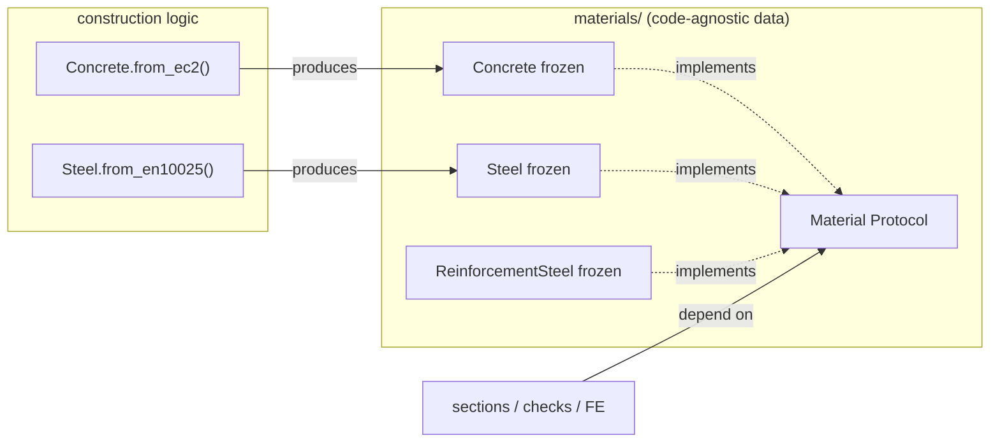

# Proposal: decouple material *data* from Eurocode *construction logic* (generic Concrete/Steel materials)

> Expansion of issue [#986](https://github.com/Blueprints-org/blueprints/issues/986).
> Written to the proposal format in `docs/guides/contribute/new-feature.md`.
> Paste this into the GitHub issue (or a comment) once reviewed.

## Problem Statement

`ConcreteMaterial`, `SteelMaterial` and `ReinforcementSteelMaterial` are *configuration
containers that compute Eurocode formulas inline*. Today the characteristic values are
derived on access from a strength-class **enum string** (e.g. `re.search(r"C(\d+)/")`,
`value[1:-1]`), and the discrete strength-class lists live inside the material type. As a
consequence:

- **You cannot represent a non-standard material.** A custom concrete mix, an imported
  USA steel alloy, or a material from a code we don't model yet cannot be built — you are
  restricted to the predefined `ConcreteStrengthClass` / `SteelStrengthClass` enums.
- **The data type is coupled to one code.** Eurocode Table 3.1 logic is baked into the
  data structure, blocking Blueprint variants and multi-standard support.
- **There is no shared material contract.** Concrete exposes `e_c`/`e_cm`, steel
  `e_modulus`, reinforcement `e_s`; concrete has no `poisson_ratio` / `shear_modulus` at
  all. Downstream tools (sections, checks, future FE/section integrations) have nothing
  uniform to depend on.

## Goal

**Separate the material *data* (physical/characteristic properties) from its *construction
logic* (code formulas)**, so a `Material` represents only physical properties, does not know
how it was created, and does not depend on Eurocode or any single source — and deliver it as
a **soft transition** that keeps every existing call-site working while the new model is
introduced.

## Use cases this must serve

1. **Standard EC2/EC3 material (today's behaviour)** — `Concrete.from_ec2(C30/37)` must
   reproduce every value `ConcreteMaterial(C30/37)` produces now.
2. **Non-standard / imported material** — build directly from raw characteristic values
   with no enum and no code dependency (the USA-alloy case from #986).
3. **FE / section interop** — a material must satisfy a minimal physical contract
   (`modulus_of_elasticity`, `poisson_ratio` → `shear_modulus`) so it can drop into
   section-property style tooling. This mirrors `robbievanleeuwen/section-properties`,
   where the FE-minimum is exactly `elastic_modulus` + `poissons_ratio`, `shear_modulus`
   derived, and the material carries zero design-code content.
4. **Consumption by downstream applications** — a material built once should be passable
   to any consuming tool (sections, checks, finite-element/section analysis) through a
   single uniform contract, rather than each consumer having to know which code produced
   it or which strength-list it came from.

## Proposed design

Three pieces, applying an established frozen-dataclass-plus-factory pattern and the
convergent lessons from `section-properties` (immutable, hashable, code-agnostic value
object; minimal shared contract; derive don't store) and `concrete-properties` (one-way
dependency: code logic *produces* materials, materials never import code logic):

1. A minimal **`Material` Protocol** — the shared physical contract.
2. **Frozen dataclass data containers** (`Concrete`, `Steel`, `ReinforcementSteel`)
   holding only pre-computed physical/characteristic data.
3. **`@classmethod` factories** (`from_ec2`, `from_en10025`) carrying the code formulas.



The dependency is **one-way**: factories import the data containers and the EC tables;
the data containers import nothing code-specific. Consumers type-hint against `Material`
(or the concrete type) and never against a code.

## Implementation Approach

### 1. The shared contract — `blueprints/materials/_material.py`

A `@runtime_checkable` Protocol using Blueprints' own unit aliases. ([`typing.Protocol`]
chosen over an ABC — see *Alternatives*, and consistent with the proposed `CheckProtocol`
in `new-feature.md`.)

```python
from typing import Protocol, runtime_checkable
from blueprints.type_alias import KG_M3, MPA, RATIO

@runtime_checkable
class Material(Protocol):
    """Minimal physical contract every Blueprints material satisfies.

    Material-specific strengths (scalar for concrete, thickness-dependent for steel)
    are intentionally *not* part of this protocol; their shape differs per material.
    """

    @property
    def name(self) -> str: ...
    @property
    def density(self) -> KG_M3: ...
    @property
    def modulus_of_elasticity(self) -> MPA: ...
    @property
    def poisson_ratio(self) -> RATIO: ...
    @property
    def shear_modulus(self) -> MPA: ...
```

### 2. Concrete data container + factory — `blueprints/materials/concrete.py`

```python
from dataclasses import dataclass
from blueprints.type_alias import DIMENSIONLESS, KG_M3, MM, MPA, PER_DEGREE, PER_MILLE, PERCENTAGE, RATIO
from blueprints.unit_conversion import GPA_TO_MPA

@dataclass(frozen=True)
class Concrete:
    """Code-agnostic concrete data container. All characteristic values are plain data,
    so alternative mixtures can be built directly through the constructor.
    Use ``Concrete.from_ec2`` to build one from a NEN-EN 1992-1-1 strength class.
    """

    name: str
    f_ck: MPA
    f_ck_cube: MPA
    f_cm: MPA
    f_ctm: MPA
    f_ctk_0_05: MPA
    f_ctk_0_95: MPA
    e_cm: MPA
    density: KG_M3 = 2500.0
    poisson_ratio: RATIO = 0.2
    material_factor: DIMENSIONLESS = 1.5
    # ... eps_c1/cu1/c2/cu2/c3/cu3, n_factor, cement_class, cement_type,
    #     aggregate_type, aggregate_size, diagram_type, plain_concrete_diagram,
    #     thermal_coefficient (all stored as data with EC2 defaults) ...

    # --- only trivial derivations of stored fields remain as properties ---
    @property
    def f_cd(self) -> MPA:
        return self.f_ck / self.material_factor

    @property
    def f_ctd(self) -> MPA:                       # fixes today's hardcoded "/ 1.5"
        return self.f_ctk_0_05 / self.material_factor

    @property
    def modulus_of_elasticity(self) -> MPA:
        return self.e_cm

    @property
    def shear_modulus(self) -> MPA:
        return self.e_cm / (2 * (1 + self.poisson_ratio))

    def rho_min(self, f_yd: MPA) -> PERCENTAGE:
        return (0.223 * (self.f_ctm / f_yd)) * 100

    @classmethod
    def from_ec2(cls, concrete_class: "ConcreteStrengthClass" = ConcreteStrengthClass.C30_37,
                 *, name: str = "", e_cm: MPA | None = None,
                 material_factor: DIMENSIONLESS = 1.5, **kwargs) -> "Concrete":
        """Build from NEN-EN 1992-1-1 Table 3.1. All inline EC formulas live here."""
        import math
        v = concrete_class.value
        f_ck = float(v[v.find("C") + 1 : v.find("/")])
        f_ck_cube = float(v[v.find("/") + 1 :])
        f_cm = f_ck + 8
        f_ctm = 0.30 * f_ck ** (2 / 3) if f_ck <= 50 else 2.12 * math.log(1 + f_cm / 10)
        return cls(
            name=name or v, f_ck=f_ck, f_ck_cube=f_ck_cube, f_cm=f_cm, f_ctm=f_ctm,
            f_ctk_0_05=f_ctm * 0.7, f_ctk_0_95=f_ctm * 1.3,
            e_cm=e_cm if e_cm is not None else int(22 * (f_cm / 10) ** 0.3 * GPA_TO_MPA),
            material_factor=material_factor,
            # eps_*, n_factor with the f_ck >= 50 branches, etc.
        )
```

**Usage:**
```python
standard = Concrete.from_ec2(ConcreteStrengthClass.C30_37)          # use case 1
custom   = Concrete(name="HPC-mix-A", f_ck=95, f_ck_cube=110,       # use case 2
                    f_cm=103, f_ctm=5.0, f_ctk_0_05=3.5,
                    f_ctk_0_95=6.5, e_cm=44_000, material_factor=1.4)
```

### 3. Steel data container + factory — `blueprints/materials/steel.py`

Thickness-dependent strengths become `StrengthRow` tables (replacing the hardcoded
`≤40 / 40–80` branching). The factory **reuses the existing**
`Table3Dot1NominalValuesHotRolledStructuralSteel` data — no strength numbers duplicated.

```python
@dataclass(frozen=True)
class StrengthRow:
    max_thickness: MM      # inclusive upper bound [mm]
    strength: MPA

@dataclass(frozen=True)
class Steel:
    name: str
    f_y_table: tuple[StrengthRow, ...]
    f_u_table: tuple[StrengthRow, ...]
    density: KG_M3 = 7850.0
    e_modulus: MPA = 210_000.0
    poisson_ratio: RATIO = 0.3
    material_factor: DIMENSIONLESS = 1.0

    @property
    def modulus_of_elasticity(self) -> MPA:
        return self.e_modulus

    @property
    def shear_modulus(self) -> MPA:
        return self.e_modulus / (2 * (1 + self.poisson_ratio))

    def f_yk(self, thickness: MM) -> MPA:
        return self._lookup(self.f_y_table, thickness).strength

    def f_yd(self, thickness: MM) -> MPA:
        return self.f_yk(thickness) / self.material_factor

    def _lookup(self, table: tuple[StrengthRow, ...], thickness: MM) -> StrengthRow:
        if thickness <= 0:
            raise ValueError(f"Thickness must be positive, got {thickness} mm")
        for row in sorted(table, key=lambda r: r.max_thickness):
            if thickness <= row.max_thickness:
                return row
        raise ValueError(f"{self.name} only available up to {max(r.max_thickness for r in table)} mm")

    @classmethod
    def from_en10025(cls, grade: "SteelStrengthClass" = SteelStrengthClass.S355, **kwargs) -> "Steel":
        ...  # build f_y_table / f_u_table from Table3Dot1NominalValuesHotRolledStructuralSteel
```

### 4. Soft transition (the core requirement)

We do **not** delete the existing classes. Each phase keeps the suite green under the
100%-coverage gate.

**Step A — additive.** Introduce `Material`, `Concrete`/`Steel`/`ReinforcementSteel`,
and the `from_*` factories *alongside* the existing classes. Nothing changes for
consumers yet.

**Step B — make the legacy classes protocol-compliant and bridge them.** Add the missing
contract members to the legacy classes (e.g. `ConcreteMaterial.poisson_ratio`,
`shear_modulus`, alias `modulus_of_elasticity`) and a `to_data()` bridge. Emit a
`DeprecationWarning` pointing at the factory:

```python
@dataclass(frozen=True)
class ConcreteMaterial:  # legacy — retained during transition
    concrete_class: ConcreteStrengthClass = ConcreteStrengthClass.C30_37
    # ... existing fields ...

    def __post_init__(self) -> None:
        warnings.warn(
            "ConcreteMaterial is deprecated; use Concrete.from_ec2(...). "
            "See issue #986.", DeprecationWarning, stacklevel=2,
        )

    # contract members so it already satisfies `Material`
    @property
    def modulus_of_elasticity(self) -> MPA:
        return self.e_cm
    @property
    def poisson_ratio(self) -> RATIO:
        return 0.2
    @property
    def shear_modulus(self) -> MPA:
        return self.modulus_of_elasticity / (2 * (1 + self.poisson_ratio))

    def to_data(self) -> Concrete:                 # one-line bridge to the new model
        return Concrete.from_ec2(
            self.concrete_class, name=self.name, material_factor=self.material_factor,
        )
```

**Step C — widen consumer type hints to the protocol.** Change signatures from
`ConcreteMaterial` to `Material` (or `Concrete`) so both old and new instances are
accepted. Production coupling is small — concrete consumers read `.f_ck` /
`.concrete_class.value`; steel reads `.yield_strength(t)` / `.density`; reinforcement
reads `.density` / `.name` — so this is mostly signatures plus a couple of attribute
renames covered by the bridge.

**Step D — migrate internally, then remove.** Switch internal construction to the
factories; once downstream usage has moved (one or two releases), delete the legacy
classes. Method-name aliases (`yield_strength` → `f_yk`) can live on the legacy shim for
the deprecation window.

### Module organization
- `blueprints/materials/_material.py` — `Material` Protocol (new).
- `blueprints/materials/{concrete,steel,reinforcement_steel}.py` — new container + factory
  added next to the legacy class; enums stay where they are (English values, unchanged).
- `blueprints/unit_conversion.py` — add `KG_TO_KN` if `Steel.unit_weight` is ported.

### Suggested PR breakdown (complex feature, per `new-feature.md`)
`Material` protocol + `KG_TO_KN` → `Concrete` + `from_ec2` (+ parity tests) → `Steel` +
`StrengthRow` + `from_en10025` → `ReinforcementSteel` → legacy bridge + deprecation →
consumer migration → removal. Each PR aims to stay under the 400-LOC threshold.

## Alternatives Considered

- **External factory *functions* vs `@classmethod`.** #986 leans toward free functions
  (`build_concrete_from_ec2(...)`). A `@classmethod from_ec2` is **preferred** here: it is
  discoverable from the type, keeps construction next to the data it produces, and still
  meets every acceptance criterion (the container embeds no code logic or discrete lists).
  Trivial to switch if the core team prefers functions.
- **`DesignCode` factory *classes* (the `concrete-properties` model).** Powerful for
  many codes, but heavier than needed now and a larger API surface. The `from_*`
  classmethod is the lightweight form of the same one-way-dependency idea; a `DesignCode`
  layer can be added later without changing the data containers.
- **Separate `StressStrainProfile` strategy objects (`concrete-properties`).** Cleanest
  long-term constitutive model, but a much bigger change. **Out of scope for #986** —
  keeping `diagram_type` as a field does not preclude it later.
- **ABC base class instead of `Protocol`.** Rejected for the same reasons as the
  `CheckProtocol` proposal: structural subtyping is more flexible, avoids forcing an
  inheritance hierarchy, and lets legacy + new classes satisfy the contract without a
  shared base.
- **Hard cut-over (delete legacy immediately).** Rejected — violates the soft-transition
  requirement and would breach the 100%-coverage gate in a single large PR.

## Forward compatibility — what we defer from section-properties / concrete-properties, and how to add it later

This proposal deliberately ships the *foundation* (a code-agnostic data container + a
minimal physical contract) and **defers** the two heavier ideas from the external repos.
Neither is lost — both are purely **additive** on top of this design.

**From `concrete-properties` — nonlinear constitutive models (`StressStrainProfile`).**
What we skip now: pluggable stress-strain curves (linear, parabolic, Mander, rectangular
block; service vs. ultimate) that enable nonlinear section analysis — moment–curvature,
stress integration over an arbitrary cross-section, confined-concrete models. Our flat
container stores scalar characteristic values plus a `diagram_type` *enum*, which is
enough for the code-formula checks Blueprints does today but **cannot** integrate an
arbitrary stress-strain law.
How to add later (no breaking change): introduce a `StressStrainProfile` protocol and
*compose* it onto the material via an optional field, e.g.
`stress_strain_profile: StressStrainProfile | None = None`, or a `with_profile(...)`
helper. Because the material is already a frozen data container with a stable contract,
adding a profile object is a new optional attribute — existing consumers and factories are
untouched. The `from_ec2` factory can later attach an `EurocodeParabolic` profile by
default. Keeping `diagram_type` now is the seam that makes this natural.

**From `concrete-properties` — `DesignCode` factory *classes*.**
What we skip now: a first-class `DesignCode` object (`EC2`, `AS3600`, …) exposing
`create_concrete_material(...)`. We use a `@classmethod from_ec2` instead — the same
one-way dependency, lighter API. How to add later: a `DesignCode` class can simply *call*
the existing `from_*` factories, so it layers on top without changing the data model.

**From `section-properties` — FE / section-analysis interop.**
This is **not** deferred — it works by default. section-properties needs only
`elastic_modulus` + `poissons_ratio` (→ shear modulus); our `Material` protocol is a
superset (`modulus_of_elasticity`, `poisson_ratio`, `shear_modulus`, `density`, `name`),
and our containers are frozen/hashable exactly as their `Material` is. The only gap is
field *naming* (`modulus_of_elasticity` vs `elastic_modulus`, `poisson_ratio` vs
`poissons_ratio`), bridged by a trivial adapter when/if we integrate:

```python
def to_sectionproperties_material(m: Material, *, yield_strength: MPA, colour: str = "grey"):
    from sectionproperties.pre import Material as SpMaterial
    return SpMaterial(
        name=m.name, elastic_modulus=m.modulus_of_elasticity,
        poissons_ratio=m.poisson_ratio, yield_strength=yield_strength,
        density=m.density, color=colour,
    )
```

**Net:** the data container + protocol is the common substrate both libraries build on.
Shipping it first unblocks #986 immediately; the constitutive-model and design-code layers
remain available as later, non-breaking additions.

## Technical considerations (per `new-feature.md`)

- **Design patterns:** Factory Method (`from_ec2`/`from_en10025`); Strategy is deferred
  (profiles); one-way dependency between code logic and data.
- **ABC vs Protocols:** `Protocol` (`@runtime_checkable`), consistent with `CheckProtocol`.
- **Inheritance vs composition:** composition/data-holding over inheritance; no material
  base class — the Protocol is the only contract.
- **Mutability:** `@dataclass(frozen=True)` → immutable & hashable (usable as dict/set
  keys when grouping section regions by material, as `section-properties` relies on).
- **Naming:** new types `Concrete`/`Steel`/`ReinforcementSteel`; contract uses
  `modulus_of_elasticity`/`poisson_ratio`/`shear_modulus`; steel `f_yk`/`f_uk`/`f_yd`.
- **Performance:** values pre-computed once in the factory instead of recomputed on every
  `@property` access — net win; `_lookup` is a small linear scan over sorted rows.
- **Backward compatibility:** addressed by the staged soft transition (deprecation
  warnings + protocol-compliant legacy shims + parity tests), satisfying the
  *Integrability and Backward Compatibility* requirement.
