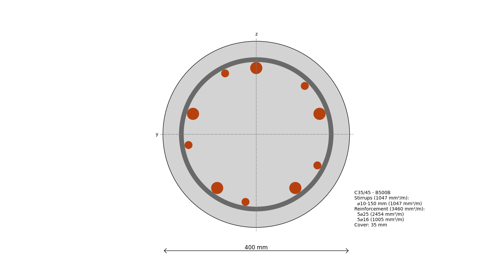

---
hide:
  - toc
---
# Create a Circular Reinforced Cross-section

Simply create a circular cross-section and add some reinforcement:

```python
--8<-- "examples/_code/circular_reinforced_cross_section.py"
```

