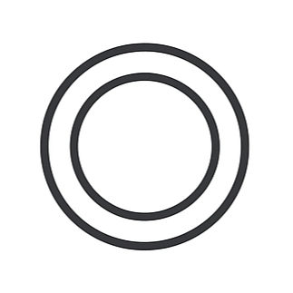
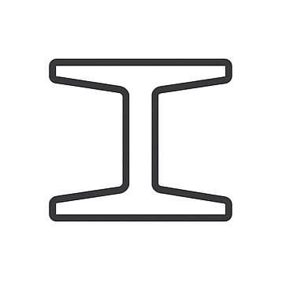
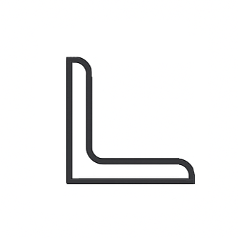

# Examples

Learn how to use Blueprints with practical examples covering steel profiles, reinforced concrete sections, and other engineering calculations.

## [Steel Profile Shapes](steel_profile_shapes/index.md)
Work with standard and custom steel profiles including CHS, I-sections, RHS, and strip profiles.

|                                       CHS Profiles                                        |                                     I Profiles                                      |                                       RHS Profiles                                        |                                         Strip Profiles                                          |                                       LNP Profiles                                        |
|:-----------------------------------------------------------------------------------------:|:-----------------------------------------------------------------------------------:|:-----------------------------------------------------------------------------------------:|:-----------------------------------------------------------------------------------------------:|:-----------------------------------------------------------------------------------------:|
|  |  |  |  |  |
|                     Round tubes commonly used in modern construction                      |                 Classic beam profiles for spanning large distances                  |                  Square and rectangular tubes for versatile applications                  |                       Flat plates for connections and custom fabrication                        |           Asymmetric L-shaped profiles for specialized structural applications            |

## [Reinforced Concrete Cross Sections](reinforced_concrete_sections/index.md) 
Create and analyze circular and rectangular reinforced concrete sections with standard or custom reinforcement layouts.

## [Other Examples](other_examples/index.md)
Additional calculations including concrete cover requirements and other design scenarios.
