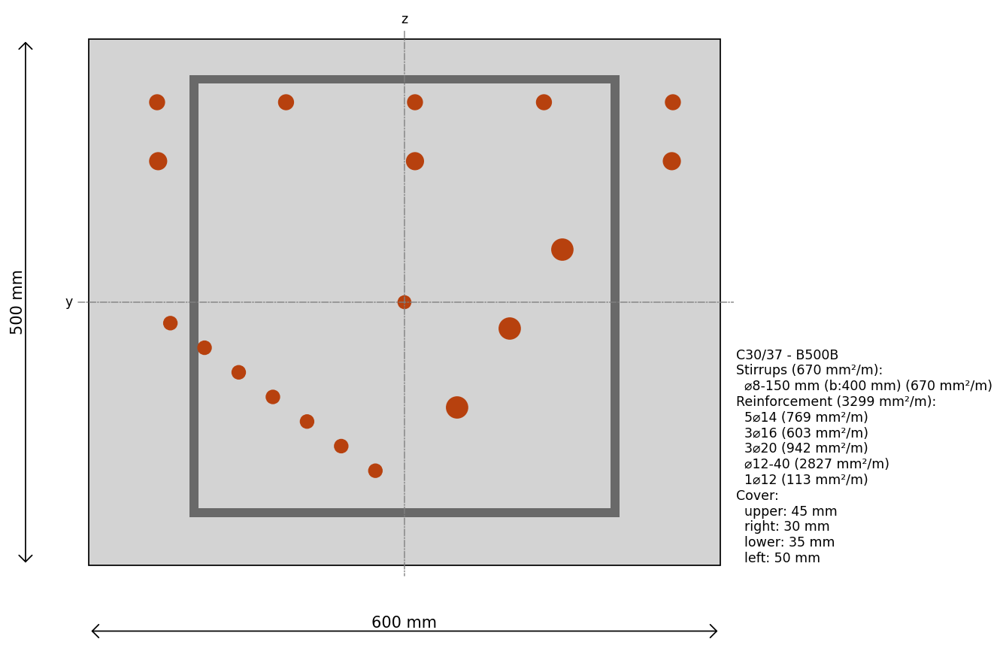

---
hide:
  - toc
---
# Create a Custom Reinforced Cross-section

And just to show that you can create any RCS you like, here is a custom one:

```python
--8<-- "examples/_code/rectangular_reinforced_cross_section_custom.py"
```

