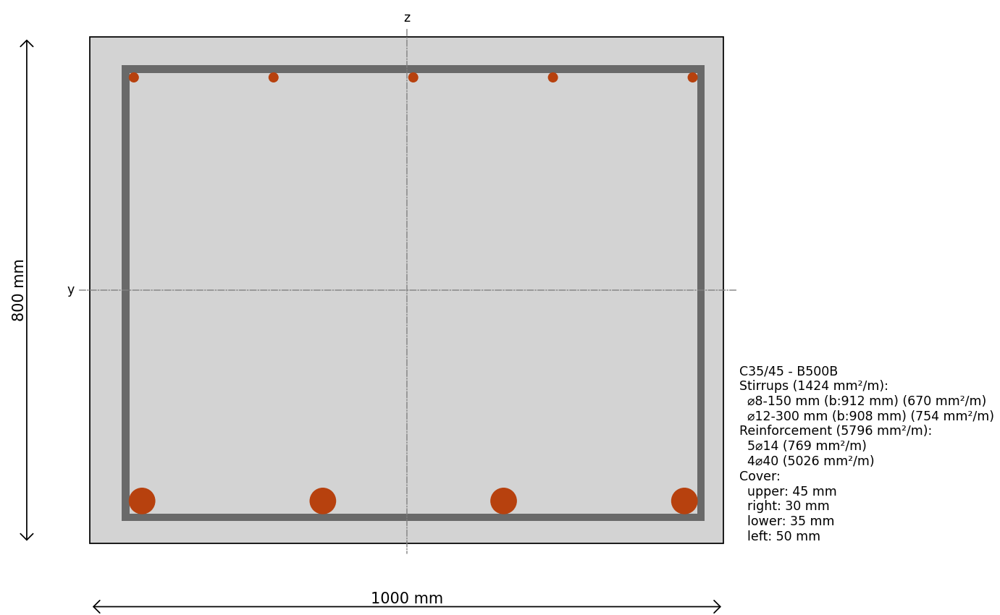

---
hide:
  - toc
---
# Create a Rectangular Reinforced Cross-section

Simply create a rectangular cross-section and add some reinforcement:



```python
--8<-- "examples/_code/rectangular_reinforced_cross_section.py"
```
