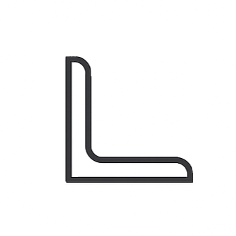

# Steel Profile Shapes

Steel profiles are fundamental building blocks in structural engineering. This section demonstrates how to work with various standard steel profile shapes using the Blueprints library. Whether you're designing buildings, bridges, or other structures, understanding how to define, visualize, and calculate properties of steel profiles is essential.

## Available Profile Types

The following steel profile examples are available:

|                                         CHS Profiles                                         |                                       I Profiles                                       |                                         RHS Profiles                                         |                                           Strip Profiles                                           |                                         LNP Profiles                                         |
|:--------------------------------------------------------------------------------------------:|:--------------------------------------------------------------------------------------:|:--------------------------------------------------------------------------------------------:|:--------------------------------------------------------------------------------------------------:|:--------------------------------------------------------------------------------------------:|
|  |  |  |  |  |
|                       Round tubes commonly used in modern construction                       |                   Classic beam profiles for spanning large distances                   |                   Square and rectangular tubes for versatile applications                    |                         Flat plates for connections and custom fabrication                         |                 Asymmetric L-shaped profiles for specialized structural applications                 |

## What You'll Learn

These examples show you how to:

- **Create standard profiles** - Use predefined steel sections that comply with industry standards
- **Define custom profiles** - Build your own profile shapes when standard ones don't meet your needs
- **Calculate section properties** - Get critical values like area, moment of inertia, and section modulus
- **Visualize profiles** - Generate clear plots to verify your profile geometry
- **Apply material properties** - Assign steel grades and account for factors like corrosion

## Quick Start

Each example follows a similar pattern:

1. Import the necessary modules
2. Define your steel material (e.g., S355, S275)
3. Create the profile using standard dimensions or custom parameters
4. Calculate section properties and visualize the result

This consistent approach makes it easy to switch between different profile types or adapt the examples for your specific projects.
