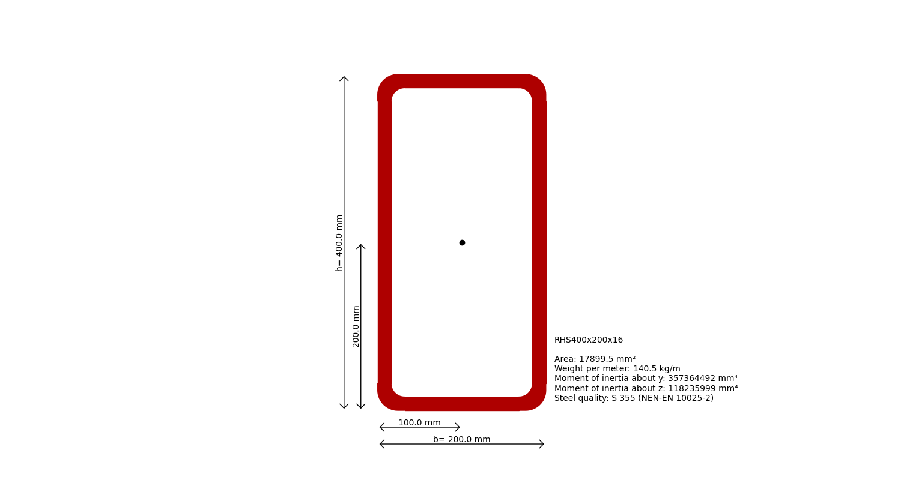
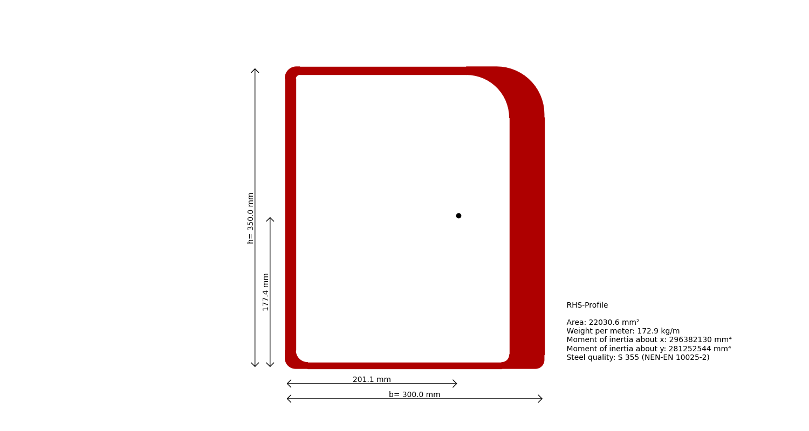

---
hide:
    - toc
---
# Steel Profile Shapes

Steel profiles are essential components in structural engineering, and their properties are critical for designing safe and efficient structures. This example demonstrates how to work with various steel profile shapes using `Blueprints`. The library provides predefined standard profiles as well as the ability to define custom profiles.

Follow the steps below to explore the usage of different steel profile shapes (or [go to the full code example](#full-code-example)):

## Define the Steel Class

Start by importing the needed elements and defining the steel material to be used for the profiles:

```python
--30<-- "examples/_code/steel_profile_shapes/rhs_profile.py:12:13"
```

## Rectangular Hollow Profiles (RHS, SHS, RHSCF, SHSCF)

### Standard RHS Profile

Predefined RHS profiles are also available:

```python
--30<-- "examples/_code/steel_profile_shapes/rhs_profile.py:15:21"
```

A plot of this profile can be generated using the `plot` method. A show=True makes the plot appear:
```python
---30<-- "examples/_code/steel_profile_shapes/rhs_profile.py:23:23"
```


Its properties can be accessed as follows:
```python
---30<-- "examples/_code/steel_profile_shapes/rhs_profile.py:24:24"
```

It you desire to use a different standard profile, you can change the `profile_name` parameter in the `IProfile` constructor.
There are many standard profiles available, such as `SHS`, `RHS`, `SHSCF`, `RHSCF`, etc. to be used as the `profile_name`.
Check all available profiles in this package: `blueprints.structural_sections.steel.steel_cross_sections.standard_profiles`.

### Custom RHS Profile

Define a custom RHS profile by specifying its width and height:

```python
--30<-- "examples/_code/steel_profile_shapes/rhs_profile.py:26:43"
```

A plot of this custom profile can be generated using the `plot` method. A show=True makes the plot appear:
```python
---30<-- "examples/_code/steel_profile_shapes/rhs_profile.py:45:45"
```



Its properties can be accessed as follows:
```python
---30<-- "examples/_code/steel_profile_shapes/rhs_profile.py:46:46"
```

<a name="full-code-example">
## Full Code Example

```python
--30<-- "examples/_code/steel_profile_shapes/rhs_profile.py"
```
</a>