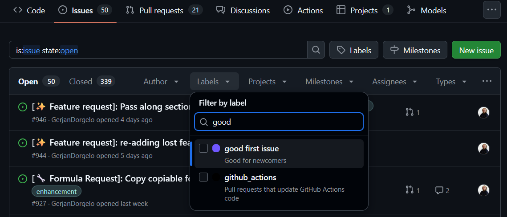

# Sprint Guide

A Blueprints sprint is a collaborative event where contributors come together to work on our open-source project.
Whether you have a few hours or a full day, our sprints are a great opportunity to contribute to Blueprints, learn from
others, and connect with your peers.

This guide will help you prepare for and participate in a Blueprints sprint. No prior experience with the project is
required and everyone is welcome!

??? note "Checklist for Your First PR"

    Use this checklist to track your progress on your first contribution:

    - [ ] Forked the repository
    - [ ] Cloned your fork locally
    - [ ] Installed dependencies with `uv sync --all-groups`
    - [ ] Created a feature branch
    - [ ] Made your changes
    - [ ] Wrote tests (100% coverage required)
    - [ ] Ran `blueprints check` and all checks passed
    - [ ] Pushed your branch
    - [ ] Opened a pull request
    - [ ] Linked the related issue

## Before You Start

Take a moment to answer these questions. They will help you (and us the sprint organizers) understand where you can
contribute most effectively.

??? question "1. Have you used Blueprints before?"

    If not, start by reading the [Quick Start guide](../../getting_started/quick_start.md) and try installing the library:
    
    ```shell
    pip install blue-prints
    ```
    or using uv (recommended):
    
    ```shell
    uv add blue-prints
    ```
    
    Run a quick example to see what Blueprints does:
    
    ```python exec="on" source="above"
    from blueprints.materials.concrete import ConcreteMaterial, ConcreteStrengthClass
    
    concrete = ConcreteMaterial(concrete_class=ConcreteStrengthClass.C30_37)
    print(f"Design strength: {concrete.f_cd} MPa")
    ```

??? question  "2. What equipment do you have?"

    Blueprints works on all major operating systems (Windows, macOS, Linux). To contribute, you'll need:
    
    - Python >=3.12, < 3.14
    - Git
    - A code editor (PyCharm, Visual Studio Code, or similar)
    - A GitHub account

??? question "3. How comfortable are you with Python?"

    Blueprints is written in Python. You don’t need to be a Python expert to get started. Basic familiarity with things like Classes/functions and type hints will help making a contribution more easy.

    In practice, a lot of work is very hands-on: for example, when adding a new formula, you can often copy an existing one and tweak it where needed. If you’re newer to Python, improving documentation or writing tests is a great and very welcome way to start contributing.

??? question "4. Are you familiar with GitHub and Git?"

    You'll need to:
    
    - Fork repositories
    - Create branches
    - Submit pull requests
    
    If this is new to you, check out [GitHub's guide to contributing to projects](https://docs.github.com/en/get-started/quickstart/contributing-to-projects).

??? question "5. Have you contributed to open source before?"

    If not, that's completely fine! Blueprints is a welcoming project for [first-time contributors](first-time-contributors.md). We'll help you through the process.

??? question "6. Do you have special skills or interests?"

    Consider your background:
    
    - **Civil/structural engineering knowledge**: Help implement formulas or checks from Eurocodes or other standards
    - **Technical writing**: Improve documentation, tutorials, and examples
    - **Math/numerical computing**: Review or implement calculations

??? question "7. What are you hoping to achieve?"

    Think about your goals:
    
    - Learn about open-source contribution?
    - Improve your Python skills?
    - Contribute to civil engineering tools?
    - Build your portfolio?
    
    Knowing your goals helps us guide you to the right tasks.

## Finding Something to Work On

### Good First Issues



The best place to start is the [issues page](https://github.com/Blueprints-org/blueprints/issues). Look for issues labeled:

- `good first issue` Suitable for newcomers
- `documentation` Writing or improving docs
- `help wanted` Tasks where we need community input

Browse the list and find something interesting.

### Claiming an Issue

Before starting work:

1. **Comment on the issue** saying you'd like to work on it
2. **Wait for confirmation** from a maintainer (usually quick during sprints)
3. **Ask questions** if anything is unclear

This prevents duplicate work and ensures you have the guidance you need.

### Types of Contributions

Not all contributions involve code! Here are some ways to help:

| Type          | Description                          | Skill Level              |
|---------------|--------------------------------------|--------------------------|
| Triage        | Help categorize and reproduce issues | Beginner                 |
| Use our library | Test features and report bugs       | Beginner                 |
| New formulas  | Implement Eurocode calculations      | Beginner - Intermediate  |
| Documentation | Improve guides, add examples         | Beginner-Intermediate    |
| Tests         | Write unit tests for existing code   | Beginner-Intermediate    |
| Bug fixes     | Fix reported issues                  | Intermediate             |
| Reviews       | Review pull requests from others     | Intermediate -  Advanced |

## During the Sprint

### Getting Help

**Stuck? Don't struggle alone!**

If you are participating online or in person, help is available:

<div class="grid cards" markdown>

- **In Person 🙋**

    - **Find a mentor**: Look for someone of the Blueprints team
    - **Ask questions**: Don't hesitate to ask for clarification or guidance
    - **Pair programming**: Work together with another contributor

- **Online 🕸**

    - **Ask in Discord**: Join our [Discord server](https://discord.gg/hBZBqegEzA) and post in the sprint channel
    - **Tag a maintainer**: During sprint events, maintainers are available to help
    - **Comment on your issue**: Ask clarifying questions directly on GitHub

</div>

There are no silly questions. **We want you to succeed!**

### Working on Your Contribution

1. **Create a branch** for your work:
   ```shell
   git checkout -b feature/your-feature-name
   ```

2. **Make small, focused changes**: PRs under 400 lines are easier to review

3. **Write tests**: We require 100% test coverage

4. **Follow the code style**: Use typehints, NumPy-style docstrings, and run:
   ```shell
   blueprints check
   ```
   This command will run linters and formatters to ensure your code meets project standards.

5. **Commit frequently**: Small commits with clear messages help reviewers

### Submitting Your Work

When you're ready:

1. **Push your branch**:
   ```shell
   git push origin feature/your-feature-name
   ```

2. **Open a pull request** on GitHub

3. **Fill in the PR template**: Describe what you changed and why

4. **Link the issue**: Include "Closes #123" in your PR description (replace 123 with the issue number)

### What happens after I submit my PR?

After submitting a Blueprints team member will review your PR, you may receive feedback or requests for changes. This is
a normal part of the process!

You will get feedback on your code, and you can address it by pushing updates to the same branch. Once approved, your PR
will be merged into our main codebase :rocket:.

## After the Sprint

### Unfinished Work

Don't worry if you don't finish during the sprint. You can continue working on your contribution at your own pace after
the event.

If you need help, reach out on Discord or ask a maintainer for assistance. If you decide not to continue, that's okay
too! Your efforts during the sprint are appreciated but please let us know so we can reassign the issue if needed.

### Stay Connected

The sprint is just the beginning! Stay involved:

- **Discord**: [Join our community](https://discord.gg/hBZBqegEzA)
- **GitHub Discussions**: [Ask questions and share ideas](https://github.com/orgs/Blueprints-org/discussions)
- **LinkedIn**: [Follow updates](https://www.linkedin.com/company/blueprints-org)

### What's Next?

After your first contribution, you could consider to look for [more issues](https://github.com/Blueprints-org/blueprints/issues) to work on, help review others' pull requests, or suggest new features.

**But the single best thing you can do to help Blueprints grow is to share it with your colleagues and friends in the civil engineering and Python communities!**

## Feedback

Is something in this guide unclear? Did you encounter problems? Let us know! Improving this guide is itself a valuable
contribution.

Open an issue or PR, or reach out on Discord. We appreciate your help making Blueprints more accessible to everyone.

*[Triage]: The process of reviewing, categorizing, and prioritizing issues in a project's issue tracker.