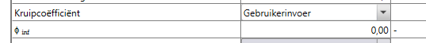
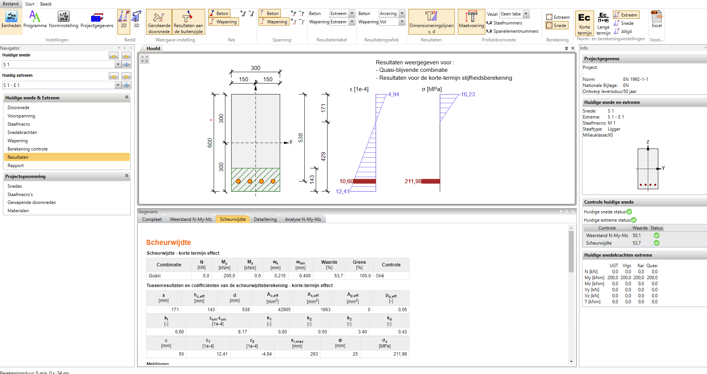

# Analyze a Reinforced Cross-section (SLS strains and stresses)

This example shows how to compute the serviceability (SLS) strains and stresses of a reinforced concrete cross-section from its section forces, using the `CrossSectionAnalysis` analyzer.

Given a `ReinforcedCrossSection` and a set of `SectionForces`, Blueprints decides whether the section is uncracked or cracked and returns the matching concrete and reinforcement results. The analyzer is shape-agnostic: it works on any `ReinforcedCrossSection` (rectangular, circular, custom).

!!! note "Optional backend required"

    The analyzer needs the optional `concreteproperties` backend. Install it with `pip install blue-prints[rc-analysis]`.

## Build the Reinforced Cross-section

We create a 300 × 500 mm beam in C30/37 with 4⌀20 B500B bars on the lower (tension) edge:

```python exec="on" source="material-block" session="rc_analysis"
from blueprints.materials.concrete import ConcreteMaterial, ConcreteStrengthClass
from blueprints.materials.reinforcement_steel import ReinforcementSteelMaterial, ReinforcementSteelQuality
from blueprints.structural_sections.concrete.reinforced_concrete_sections.analysis import CrossSectionAnalysis
from blueprints.structural_sections.concrete.reinforced_concrete_sections.rectangular import RectangularReinforcedCrossSection
from blueprints.structural_sections.section_forces import SectionForces

concrete = ConcreteMaterial(concrete_class=ConcreteStrengthClass.C30_37)
steel = ReinforcementSteelMaterial(steel_quality=ReinforcementSteelQuality.B500B)

cs = RectangularReinforcedCrossSection(width=300, height=500, concrete_material=concrete)
cs.add_longitudinal_reinforcement_by_quantity(n=4, diameter=20, edge="lower", material=steel)
```

Let's visualize the cross-section and its reinforcement:

```python exec="on" source="above" result="html" html="true" session="rc_analysis"
cs.plot(show=False)

from io import StringIO  # markdown-exec: hide
import matplotlib.pyplot as plt  # markdown-exec: hide
buffer = StringIO()  # markdown-exec: hide
plt.savefig(buffer, format="svg")  # markdown-exec: hide
print(buffer.getvalue())  # markdown-exec: hide
```

## Run the Analysis

We create the analyzer and call `calculate_stress`. Blueprints runs the cheap uncracked analysis first and, if the concrete tensile stress exceeds the flexural tensile strength, returns the cracked result instead.

Here we apply a small compression and a bending moment about the y-axis:

```python exec="on" source="material-block" result="ansi" session="rc_analysis"
analysis = CrossSectionAnalysis(cs)

forces = SectionForces(n=-100, m_y=150)  # 100 kN compression, 150 kNm about the y-axis
result = analysis.calculate_stress(forces)

print(f"Cracked regime: {result.is_cracked}")
print(f"Concrete stress (min / max): {result.concrete_stress_min:.2f} / {result.concrete_stress_max:.2f} MPa")
```

Stresses and strains follow the Blueprints convention: **compression negative, tension positive**, consistent with a positive normal force being tension.

## Inspect the Reinforcement Results

Each longitudinal bar carries its own stress, strain and force:

```python exec="on" source="material-block" result="ansi" session="rc_analysis"
for bar in result.rebar_results:
    print(
        f"bar at (x={bar.x:6.1f}, y={bar.y:6.1f}) mm  ->  "
        f"stress {bar.stress:7.1f} MPa, strain {bar.strain:6.3f} per mille, force {bar.force:6.1f} kN"
    )
```

## Cracked Section Properties

When the section cracks, the result also carries the cracked-section properties: the cracking moment, the neutral-axis depth and the cracked second moment of area.

```python exec="on" source="material-block" result="ansi" session="rc_analysis"
if result.cracked_properties is not None:
    cracked = result.cracked_properties
    print(f"Cracking moment m_cr:    {cracked.m_cr:.1f} kNm")
    print(f"Neutral-axis depth:      {cracked.neutral_axis_depth:.1f} mm")
    print(f"Cracked second moment I: {cracked.i_cracked:.3e} mm4")
```

## Force a Specific Regime

Besides the automatic decision, you can request a specific regime explicitly, for example to compare the cracked and uncracked states of the same section:

```python exec="on" source="material-block" result="ansi" session="rc_analysis"
uncracked = analysis.uncracked_stress(forces)
cracked = analysis.cracked_stress(forces)

print(f"Uncracked max concrete tensile stress: {uncracked.concrete_stress_max:.2f} MPa")
print(f"Cracked max reinforcement stress:      {max(bar.stress for bar in cracked.rebar_results):.1f} MPa")
```

## Visualize the Strain and Stress State

`result.plot()` draws the strain (ε) and stress (σ) diagrams over the section height, in the style of section-analysis software such as IDEA StatiCa RCS. It has three panels that share the height axis:

- **section** — the outline with the reinforcement; the concrete in compression (strain < 0) is hatched.
- **ε [‰]** — the linear strain profile, with the strain value at each reinforcement bar.
- **σ [MPa]** — the concrete stress block (zero in the cracked tension zone), and the reinforcement stresses on a **separate axis** (steel stresses are an order of magnitude larger than the concrete stress, so they get their own scale to stay legible).

The green dashed line marks the neutral axis. Everything is projected onto the axis perpendicular to the neutral axis, so uniaxial and biaxial-uncracked states both render upright.

```python exec="on" source="above" result="html" html="true" session="rc_analysis"
result.plot()

from io import StringIO  # markdown-exec: hide
import matplotlib.pyplot as plt  # markdown-exec: hide
buffer = StringIO()  # markdown-exec: hide
plt.savefig(buffer, format="svg")  # markdown-exec: hide
print(buffer.getvalue())  # markdown-exec: hide
```

### The strain plane

Behind the figure sits the reconstructed **strain plane** — the linear strain field over the section (plane sections remain plane). It is available directly on the result and lets you query the strain anywhere:

```python exec="on" source="material-block" result="ansi" session="rc_analysis"
plane = result.strain_plane
print(f"strain at the origin:   {plane.eps_0:6.3f} per mille")
print(f"neutral-axis angle:     {plane.neutral_axis_angle:6.1f} deg")
print(f"strain at top fibre:    {plane.strain_at(0, 250):6.3f} per mille")
print(f"strain at bottom fibre: {plane.strain_at(0, -250):6.3f} per mille")
```

!!! tip "Backend mesh contour"

    The 2D mesh stress contour from the `concreteproperties` backend is still available under its own name, `result.plot_mesh_stress()`, which forwards its arguments to the backend plotter.

## Sagging versus Hogging

The cracked behaviour depends on the direction of bending: a positive `m_y` (sagging) cracks the bottom and engages the bottom reinforcement, while a negative `m_y` (hogging) cracks the top and engages the top reinforcement. The two regimes have a different neutral-axis depth and cracked stiffness.

We build a beam with both top and bottom reinforcement and compare the two:

```python exec="on" source="material-block" result="ansi" session="rc_bending"
from blueprints.materials.concrete import ConcreteMaterial, ConcreteStrengthClass
from blueprints.materials.reinforcement_steel import ReinforcementSteelMaterial
from blueprints.structural_sections.concrete.reinforced_concrete_sections.analysis import CrossSectionAnalysis
from blueprints.structural_sections.concrete.reinforced_concrete_sections.rectangular import RectangularReinforcedCrossSection
from blueprints.structural_sections.section_forces import SectionForces

steel = ReinforcementSteelMaterial()
cs = RectangularReinforcedCrossSection(width=300, height=500, concrete_material=ConcreteMaterial(ConcreteStrengthClass.C30_37))
cs.add_longitudinal_reinforcement_by_quantity(n=4, diameter=20, edge="lower", material=steel)  # bottom
cs.add_longitudinal_reinforcement_by_quantity(n=3, diameter=16, edge="upper", material=steel)  # top
analysis = CrossSectionAnalysis(cs)

sagging = analysis.cracked_stress(SectionForces(m_y=150))
hogging = analysis.cracked_stress(SectionForces(m_y=-150))

for label, result in [("sagging (+M)", sagging), ("hogging (-M)", hogging)]:
    properties = result.cracked_properties
    print(
        f"{label}: neutral-axis depth {properties.neutral_axis_depth:6.1f} mm, "
        f"cracking moment {properties.m_cr:5.1f} kNm, cracked I {properties.i_cracked:.3e} mm4"
    )
```

The hogging case has a shallower neutral axis and a smaller cracked second moment of area, because the top reinforcement ratio is lower than the bottom. This is visible in the two cracked strain/stress figures below — sagging first, hogging below. Note how the hatched compression zone flips from the top (sagging) to the bottom (hogging):

```python exec="on" source="above" result="html" html="true" session="rc_bending"
sagging.plot()

from io import StringIO  # markdown-exec: hide
import matplotlib.pyplot as plt  # markdown-exec: hide
buffer = StringIO()  # markdown-exec: hide
plt.savefig(buffer, format="svg")  # markdown-exec: hide
print(buffer.getvalue())  # markdown-exec: hide
```

```python exec="on" source="above" result="html" html="true" session="rc_bending"
hogging.plot()

from io import StringIO  # markdown-exec: hide
import matplotlib.pyplot as plt  # markdown-exec: hide
buffer = StringIO()  # markdown-exec: hide
plt.savefig(buffer, format="svg")  # markdown-exec: hide
print(buffer.getvalue())  # markdown-exec: hide
```

## Biaxial Bending

Under **biaxial bending** (a moment about both axes at once) the analyzer accepts `m_y` and `m_z` together. We analyze a 400 × 400 mm column with a bar in each corner:

```python exec="on" source="material-block" result="ansi" session="rc_biaxial"
from blueprints.materials.concrete import ConcreteMaterial, ConcreteStrengthClass
from blueprints.materials.reinforcement_steel import ReinforcementSteelMaterial
from blueprints.structural_sections.concrete.rebar import Rebar
from blueprints.structural_sections.concrete.reinforced_concrete_sections.analysis import CrossSectionAnalysis
from blueprints.structural_sections.concrete.reinforced_concrete_sections.rectangular import RectangularReinforcedCrossSection
from blueprints.structural_sections.section_forces import SectionForces

steel = ReinforcementSteelMaterial()
cs = RectangularReinforcedCrossSection(width=400, height=400, concrete_material=ConcreteMaterial(ConcreteStrengthClass.C30_37))
for x in (-150, 150):
    for y in (-150, 150):
        cs.add_longitudinal_rebar(Rebar(diameter=25, x=x, y=y, material=steel))

result = CrossSectionAnalysis(cs).uncracked_stress(SectionForces(m_y=80, m_z=60))

print(f"Concrete stress (min / max): {result.concrete_stress_min:.2f} / {result.concrete_stress_max:.2f} MPa")
for bar in result.rebar_results:
    print(f"corner ({bar.x:+.0f}, {bar.y:+.0f}) mm  ->  stress {bar.stress:+6.1f} MPa")
```

The biaxial moment tilts the stress plane diagonally: one corner reaches the largest tension and the opposite corner the largest compression.

```python exec="on" source="above" result="html" html="true" session="rc_biaxial"
result.plot()

from io import StringIO  # markdown-exec: hide
import matplotlib.pyplot as plt  # markdown-exec: hide
buffer = StringIO()  # markdown-exec: hide
plt.savefig(buffer, format="svg")  # markdown-exec: hide
print(buffer.getvalue())  # markdown-exec: hide
```

!!! warning "Cracked biaxial bending is not supported"

    The **uncracked** biaxial analysis above is exact (linear superposition of `m_y` and `m_z`). The **cracked** analysis, however, is uniaxial: under biaxial bending the cracked neutral axis is not perpendicular to the moment vector, which requires an iterative biaxial solution that is out of scope here. `cracked_stress`, `cracked_properties` and `calculate_stress` (when the section would crack) therefore raise a `NotImplementedError` for biaxial input rather than return an unreliable result. Apply bending about a single axis for cracked analyses.

## Other Section Shapes: Circular

The same analyzer works on a circular column. Here we analyze a 500 mm diameter section with 8⌀20 bars under a normal force and bending:

```python exec="on" source="material-block" result="ansi" session="rc_circular"
from blueprints.materials.concrete import ConcreteMaterial, ConcreteStrengthClass
from blueprints.materials.reinforcement_steel import ReinforcementSteelMaterial
from blueprints.structural_sections.concrete.reinforced_concrete_sections.analysis import CrossSectionAnalysis
from blueprints.structural_sections.concrete.reinforced_concrete_sections.circular import CircularReinforcedCrossSection
from blueprints.structural_sections.section_forces import SectionForces

cs = CircularReinforcedCrossSection(diameter=500, concrete_material=ConcreteMaterial(ConcreteStrengthClass.C30_37))
cs.add_longitudinal_reinforcement_by_quantity(n=8, diameter=20, material=ReinforcementSteelMaterial())

result = CrossSectionAnalysis(cs).calculate_stress(SectionForces(n=-200, m_y=120))

print(f"Cracked regime: {result.is_cracked}")
print(f"Concrete stress (min / max): {result.concrete_stress_min:.2f} / {result.concrete_stress_max:.2f} MPa")
print(f"Max reinforcement stress:    {max(bar.stress for bar in result.rebar_results):.1f} MPa")
```

The circular section with its 8 bars, and the resulting stress state:

```python exec="on" source="above" result="html" html="true" session="rc_circular"
cs.plot(show=False)

from io import StringIO  # markdown-exec: hide
import matplotlib.pyplot as plt  # markdown-exec: hide
buffer = StringIO()  # markdown-exec: hide
plt.savefig(buffer, format="svg")  # markdown-exec: hide
print(buffer.getvalue())  # markdown-exec: hide
```

```python exec="on" source="above" result="html" html="true" session="rc_circular"
result.plot()

from io import StringIO  # markdown-exec: hide
import matplotlib.pyplot as plt  # markdown-exec: hide
buffer = StringIO()  # markdown-exec: hide
plt.savefig(buffer, format="svg")  # markdown-exec: hide
print(buffer.getvalue())  # markdown-exec: hide
```

## Validation against IDEA StatiCa RCS

The analyzer is validated against established section-analysis software. The reference case below is defined precisely so it can be reproduced in IDEA StatiCa RCS and compared with the Blueprints result.

**Reference case** — rectangular 300 × 600 mm, C30/37, 4⌀25 B500B on the lower edge (50 mm cover), under a pure bending moment `M_y = 200 kNm` (SLS, `N = 0`).

!!! info "Reproducing this case in IDEA StatiCa RCS"

    | Input | Value |
    |---|---|
    | Code / National Annex | EN 1992-1-1 / EN |
    | Section | rectangular 300 × 600 mm |
    | Concrete | C30/37 |
    | Reinforcement | 4⌀25 B500B, lower edge |
    | Concrete cover (to bar surface) | 50 mm (effective depth d = 538 mm) |
    | Load combination | quasi-permanent, `N = 0`, `M_y = 200 kNm`, `M_z = 0` |
    | Stiffness | short-term |
    | Creep coefficient φ | 0 (user input) |

    Read the results from the **crack-width (Scheurwijdte)** check: `x` is the neutral-axis depth, `σ_s` the reinforcement stress, and the strain/stress diagram gives the concrete stress and the strain plane.

    The creep coefficient is set to zero to obtain a short-term result comparable to the Blueprints secant modulus `E_cm`:

    

```python exec="on" source="material-block" result="ansi" session="rc_idea"
from blueprints.materials.concrete import ConcreteMaterial, ConcreteStrengthClass
from blueprints.materials.reinforcement_steel import ReinforcementSteelMaterial, ReinforcementSteelQuality
from blueprints.structural_sections.concrete.reinforced_concrete_sections.analysis import CrossSectionAnalysis
from blueprints.structural_sections.concrete.reinforced_concrete_sections.rectangular import RectangularReinforcedCrossSection
from blueprints.structural_sections.section_forces import SectionForces

cs = RectangularReinforcedCrossSection(width=300, height=600, concrete_material=ConcreteMaterial(ConcreteStrengthClass.C30_37))
cs.add_longitudinal_reinforcement_by_quantity(n=4, diameter=25, edge="lower", material=ReinforcementSteelMaterial(ReinforcementSteelQuality.B500B))

result = CrossSectionAnalysis(cs).calculate_stress(SectionForces(m_y=200))
cracked = result.cracked_properties

print(f"Cracked regime:            {result.is_cracked}")
print(f"Max concrete compression:  {result.concrete_stress_min:.2f} MPa")
print(f"Reinforcement stress:      {result.rebar_results[0].stress:.1f} MPa")
print(f"Reinforcement strain:      {result.rebar_results[0].strain:.3f} per mille")
print(f"Neutral-axis depth:        {cracked.neutral_axis_depth:.1f} mm")
print(f"Cracking moment m_cr:      {cracked.m_cr:.1f} kNm")
```

```python exec="on" source="above" result="html" html="true" session="rc_idea"
result.plot()

from io import StringIO  # markdown-exec: hide
import matplotlib.pyplot as plt  # markdown-exec: hide
buffer = StringIO()  # markdown-exec: hide
plt.savefig(buffer, format="svg")  # markdown-exec: hide
print(buffer.getvalue())  # markdown-exec: hide
```

### Comparison

| Quantity | Blueprints | IDEA StatiCa RCS | Difference |
|---|---|---|---|
| Cracked regime | cracked | cracked | — |
| Max concrete compression [MPa] | −16.24 | −16.23 | 0.1% |
| Reinforcement stress [MPa] | 212.3 | 211.98 | 0.2% |
| Reinforcement strain [‰] | 1.061 | 1.060 | 0.1% |
| Neutral-axis depth [mm] | 170.8 | 171 | 0.1% |

The two agree within ~0.2%, confirming the linear-elastic SLS analysis against established software. The cracking moment `m_cr` and cracked second moment of area `i_cracked` are Blueprints outputs; IDEA StatiCa RCS does not report a single cracking-moment or cracked-inertia value in its crack-width check, so they are not compared here.



The IDEA StatiCa RCS output for the reference case. The strain diagram (in units of 1e-4) reads −4.94 at the top fibre (−0.494‰) and 10.60 at the reinforcement (1.060‰); the stress diagram reads −16.23 MPa in the concrete and 211.98 MPa in the reinforcement; the neutral-axis depth is x = 171 mm.

!!! warning "Modelling differences"

    Blueprints performs a **linear-elastic SLS** analysis: concrete is linear up to cracking with secant modulus `E_cm`, reinforcement is elastic at `f_yk / E_s` (no partial factor), tension stiffening is **not** included, and the cracking decision uses the flexural tensile strength `f_ctm,fl` (EN 1992-1-1 art. 3.1.8). IDEA StatiCa RCS may use slightly different modelling choices (effective/long-term E-modulus, tension stiffening per EN 1992-1-1 art. 7.4.3, different tension behaviour). When comparing, configure the IDEA case to a short-term linear analysis without tension stiffening, and expect small residual differences from the meshing and material-model details. The tolerances used in the automated test suite are set per reference case accordingly.

## Summary

This page demonstrated the SLS stress/strain analysis of reinforced concrete cross-sections:

1. **Build** a `ReinforcedCrossSection` (rectangular, circular or custom) with materials and reinforcement
2. **Create** a `CrossSectionAnalysis` and call `calculate_stress` with `SectionForces`
3. **Let Blueprints decide** between the uncracked and cracked regime
4. **Inspect** concrete stresses, per-bar stresses/strains/forces and cracked-section properties
5. **Visualize** the strain (ε) and stress (σ) diagrams over the section height with `result.plot()`, and query the strain field anywhere with `result.strain_plane`
6. **Compare** sagging and hogging, and analyze different section shapes with the same API
7. **Validate** against external section-analysis software (IDEA StatiCa RCS)

Key points:

- All results use the Blueprints convention: **compression negative, tension positive**, in MPa, per mille and kN.
- The regime decision handles combined N + M naturally: compression raises the cracking threshold, tension lowers the margin.
- The analyzer is shape-agnostic — the same `CrossSectionAnalysis` works for rectangular, circular and custom sections.
- Biaxial bending (`m_y` + `m_z`) is supported for the uncracked analysis; cracked biaxial bending is not supported and raises a `NotImplementedError`.
- Shear and torsion are deliberately out of scope of the stress analysis; they are handled as truss-model resistance checks (EN 1992-1-1 art. 6.2/6.3).
