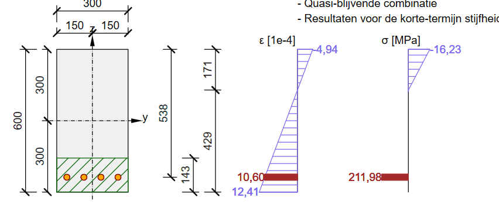
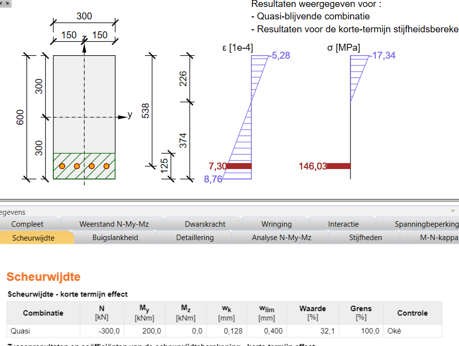
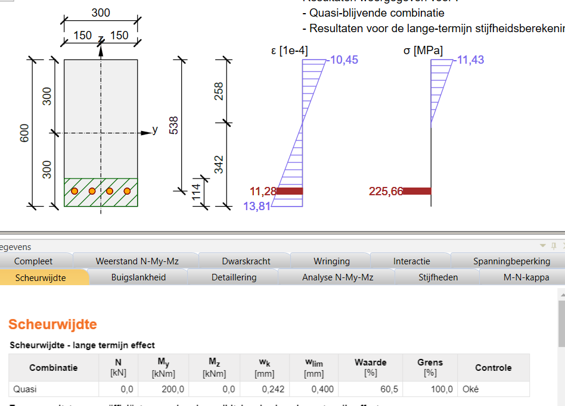
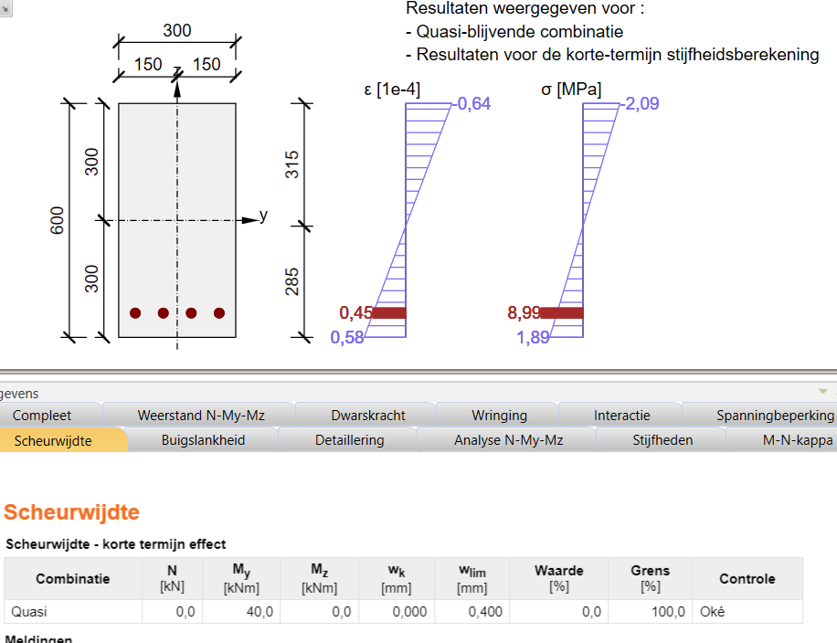
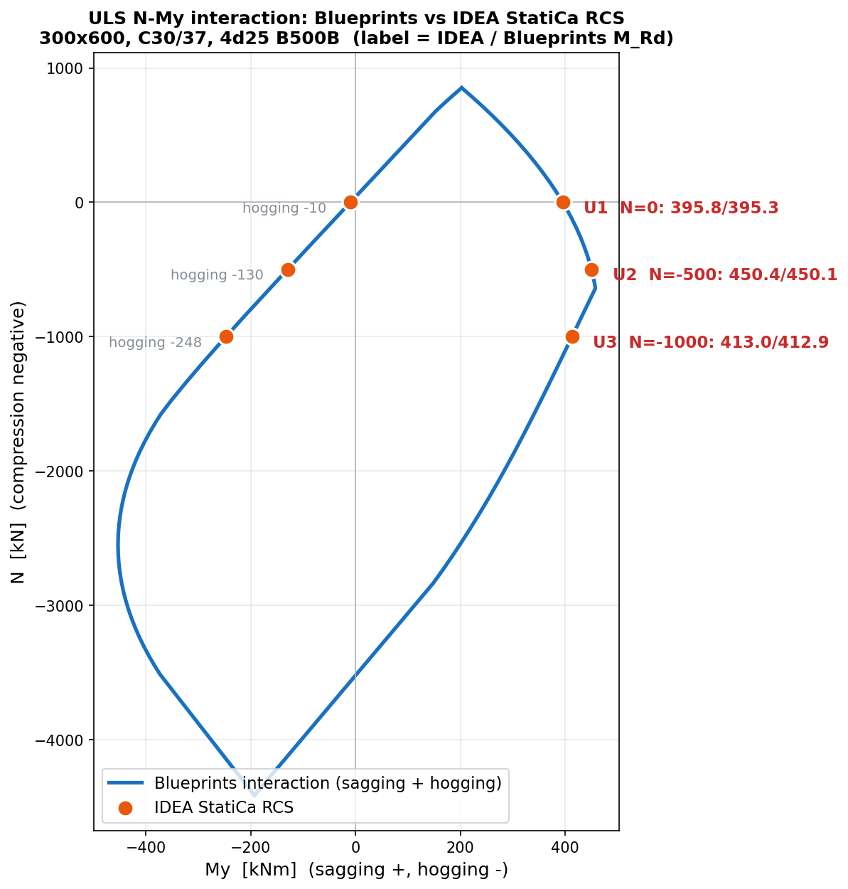
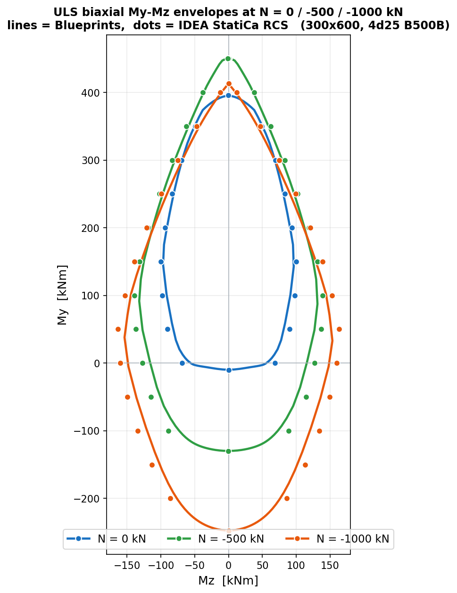
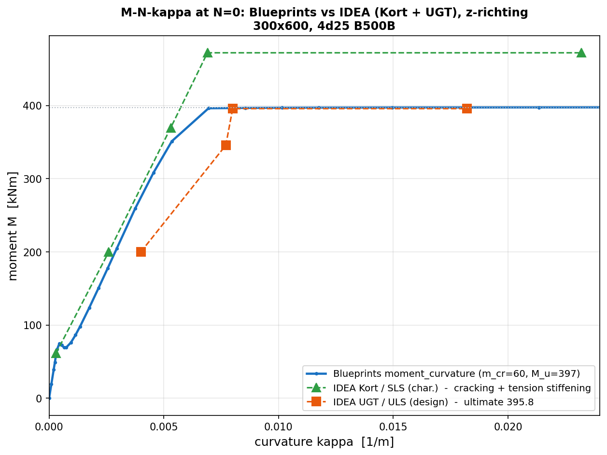
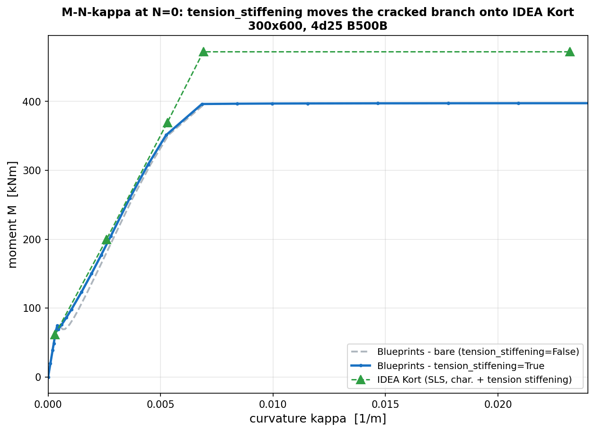

# Validation of the Cross-section Analysis

The `CrossSectionAnalysis` results are validated two independent ways: **closed-form hand calculations** that can be followed on paper, and a comparison against **IDEA StatiCa RCS** on precisely defined reference cases. Both are pinned in the automated test suite.

This page is part of the [cross-section analysis guide](index.md), together with the [SLS stress/strain analysis](sls.md) and [ULS capacity & checks](uls.md) pages.

!!! note "Reference section and material values"

    All hand calculations, the IDEA StatiCa RCS cases and the [SLS](sls.md) and [ULS](uls.md) worked examples use the same **reference beam**: rectangular 300 × 600 mm, C30/37, 4⌀25 B500B on the lower edge (50 mm cover, effective depth `d = 537.5 mm`, `A_s = 1963 mm²`).

    Material values: `E_cm = 32 836 MPa`, `E_s = 200 000 MPa` → modular ratio `α_e = E_s / E_cm = 6.09`; `f_cd = 20.0 MPa`, `f_yd = 434.8 MPa`.

## Hand calculation — SLS, pure bending (cracked)

The reference beam under a pure bending moment $M = 200$ kNm ($N = 0$). Linear-elastic cracked transformed section: the concrete carries compression only, the steel is transformed with the modular ratio.

**Inputs.**

$$ A_s = 4 \cdot \frac{\pi}{4}\,(25)^2 = 4 \times 490.9 = 1963\ \text{mm}^2, \qquad \alpha_e = \frac{E_s}{E_{cm}} = \frac{200\,000}{32\,836} = 6.09 $$

**1. Neutral axis** $x$ — the first moment of the cracked transformed area about the neutral axis (depth $x$ from the compression fibre) is zero, $\tfrac{b\,x^2}{2} = \alpha_e A_s\,(d - x)$:

$$ \frac{300}{2}\,x^2 = 6.09 \times 1963 \times (537.5 - x) \quad\Rightarrow\quad 150\,x^2 + 11\,955\,x - 6.426\times10^{6} = 0 $$

$$ x = \frac{-11\,955 + \sqrt{11\,955^2 + 4 \times 150 \times 6.426\times10^{6}}}{2 \times 150} = \frac{-11\,955 + 63\,234}{300} = 171.0\ \text{mm} $$

**2. Cracked second moment of area** about the neutral axis:

$$ I_{cr} = \frac{b\,x^3}{3} + \alpha_e A_s\,(d - x)^2 = \frac{300 \times 171.0^3}{3} + 6.09 \times 1963 \times (537.5 - 171.0)^2 $$

$$ = 5.00\times10^{8} + 11\,955 \times 366.5^2 = 5.00\times10^{8} + 1.606\times10^{9} = 2.106\times10^{9}\ \text{mm}^4 $$

**3. Stresses** from $\sigma = M\,y / I_{cr}$ (the steel scaled by $\alpha_e$):

$$ \sigma_c = \frac{M\,x}{I_{cr}} = \frac{200\times10^{6} \times 171.0}{2.106\times10^{9}} = 16.2\ \text{MPa} $$

$$ \sigma_s = \frac{\alpha_e\,M\,(d - x)}{I_{cr}} = \frac{6.09 \times 200\times10^{6} \times 366.5}{2.106\times10^{9}} = 212\ \text{MPa}, \qquad \varepsilon_s = \frac{\sigma_s}{E_s} = \frac{212}{200\,000} = 1.06\ ‰ $$

Reproduce this in Blueprints — build the reference beam and read the same values back:

```python exec="on" source="material-block" result="ansi" session="rc_validation"
from blueprints.materials.concrete import ConcreteMaterial, ConcreteStrengthClass
from blueprints.materials.reinforcement_steel import ReinforcementSteelMaterial, ReinforcementSteelQuality
from blueprints.structural_sections.concrete.reinforced_concrete_sections.analysis import CrossSectionAnalysis
from blueprints.structural_sections.concrete.reinforced_concrete_sections.rectangular import RectangularReinforcedCrossSection
from blueprints.structural_sections.section_forces import SectionForces

# reference beam: 300 x 600 mm, C30/37, 4d25 B500B on the lower edge
cs = RectangularReinforcedCrossSection(width=300, height=600, concrete_material=ConcreteMaterial(ConcreteStrengthClass.C30_37))
cs.add_longitudinal_reinforcement_by_quantity(n=4, diameter=25, edge="lower", material=ReinforcementSteelMaterial(ReinforcementSteelQuality.B500B))
analysis = CrossSectionAnalysis(cs)

result = analysis.stress(SectionForces(m_y=200))  # pure bending, N = 0
print(f"x       = {result.strain_plane.neutral_axis_depth:5.1f} mm")
print(f"sigma_c = {result.concrete_stress_min:6.2f} MPa")
print(f"sigma_s = {max(bar.stress for bar in result.rebar_results):6.1f} MPa")
```

matching the hand calculation within 0.1 %.

## Hand calculation — SLS, combined N + M (cracked)

The same beam, now with an axial compression $N = -300$ kN alongside $M = 200$ kNm. The axial force acts off the cracked centroid, so the neutral axis is **no longer** the pure-bending value: it deepens so that axial *and* moment equilibrium hold at the same time.

**1. Neutral axis** $x$ — with a linear strain plane (curvature $\kappa$, zero strain at depth $x$), the concrete forms a triangular compression block and the steel a point force. Enforcing axial equilibrium and moment equilibrium about the section centroid,

$$ \underbrace{\tfrac{1}{2} E_{cm}\,\kappa\,b\,x^2}_{\text{concrete (compression)}} - \underbrace{E_s\,\kappa\,A_s\,(d - x)}_{\text{steel (tension)}} = N, \qquad \text{moment about the centroid} = M, $$

solved simultaneously for $x$ and $\kappa$ (iteratively — there is no closed form) gives a **deeper** neutral axis:

$$ x = 225.6\ \text{mm} \quad (\text{versus } 171\ \text{mm for pure bending}). $$

**2. Strains** from the solved plane — at the top fibre and at the reinforcement:

$$ \varepsilon_c = -0.528\ ‰, \qquad \varepsilon_s = +0.730\ ‰. $$

**3. Stresses** ($\sigma = E\,\varepsilon$, both materials linear-elastic):

$$ \sigma_c = E_{cm}\,\varepsilon_c = 32\,836 \times (-0.528\times10^{-3}) = -17.3\ \text{MPa} $$

$$ \sigma_s = E_s\,\varepsilon_s = 200\,000 \times 0.730\times10^{-3} = 146\ \text{MPa} $$

Reproduce in Blueprints, reusing the `analysis` built above — only the section forces change:

```python exec="on" source="material-block" result="ansi" session="rc_validation"
result = analysis.stress(SectionForces(n=-300, m_y=200))  # combined N + M
print(f"x       = {result.strain_plane.neutral_axis_depth:5.1f} mm")
print(f"sigma_c = {result.concrete_stress_min:6.2f} MPa")
print(f"sigma_s = {max(bar.stress for bar in result.rebar_results):6.1f} MPa")
```

matching the hand calculation within 0.2 %.

!!! warning "Why this case matters"

    Reusing the pure-bending crack depth ($x = 171$ mm) here — instead of solving for the actual $x = 226$ mm — would delete a ~55 mm strip of concrete that is really in compression and overestimate the steel stress by about 25 %, an error that grows with the axial force. Blueprints therefore solves the true cracked N + M equilibrium; see the [neutral-axis note](#neutral-axis-actual-state-versus-pure-bending-constant) below.

## Hand calculation — ULS bending capacity

The reference beam ($A_s = 1963\ \text{mm}^2$, $d = 537.5$ mm, $A_c = b\,h = 300 \times 600 = 180\,000\ \text{mm}^2$) with design materials and the bilinear concrete stress block ($\varepsilon_{c3} = 1.75‰$, $\varepsilon_{cu3} = 3.5‰$). The mean-stress factor $\alpha$ and the block-centroid factor $\beta$ of that block are

$$ \alpha = 1 - \frac{\varepsilon_{c3}}{2\,\varepsilon_{cu3}} = 1 - \frac{1.75}{2 \times 3.5} = 0.75, \qquad \beta = 0.389 \quad (\text{block centroid at } 0.389\,x \text{ from the compression fibre}). $$

**1. Reinforcement force** (yielding, $\sigma_s = f_{yd}$):

$$ T = A_s\,f_{yd} = 1963 \times 434.8 = 853\,512\ \text{N} = 854\ \text{kN} $$

**2. Neutral-axis depth** from axial equilibrium $\alpha\,f_{cd}\,b\,x = T$:

$$ x = \frac{T}{\alpha\,f_{cd}\,b} = \frac{853\,512}{0.75 \times 20 \times 300} = \frac{853\,512}{4500} = 190\ \text{mm} $$

**3. Bending capacity** with the internal lever arm $z = d - \beta\,x$:

$$ z = 537.5 - 0.389 \times 190 = 464\ \text{mm}, \qquad M_{Rd} = T\,z = 853\,512 \times 464 = 3.96\times10^{8}\ \text{Nmm} = 396\ \text{kNm} $$

**Axial endpoints.** The squash load and the tensile capacity follow directly:

$$ N_{Rd} = -\big(f_{cd}\,(A_c - A_s) + A_s\,f_{yd}\big) = -\big(20 \times (180\,000 - 1963) + 853\,512\big) = -(3\,560\,740 + 853\,512) = -4\,414\,252\ \text{N} = -4414\ \text{kN} $$

$$ N_{t} = A_s\,f_{yd} = 853\,512\ \text{N} = +854\ \text{kN} $$

Reproduce the capacity and the axial endpoints in Blueprints, again reusing `analysis`:

```python exec="on" source="material-block" result="ansi" session="rc_validation"
capacity = analysis.bending_capacity()  # sagging M_Rd at N = 0
diagram = analysis.interaction()        # N-M diagram: its extremes are the axial endpoints
print(f"M_Rd    = {capacity.m_rd:6.1f} kNm  (x = {capacity.neutral_axis_depth:.1f} mm)")
print(f"squash  = {min(point.n for point in diagram.points):7.0f} kN")
print(f"tension = {max(point.n for point in diagram.points):7.0f} kN")
```

matching the hand calculations within 0.2 %.

!!! info "Further anchors in the test suite"

    The automated tests pin additional closed-form results on these sections: the **moment-curvature** uncracked branch against $E_{cm}\,I$ of the transformed section, its cracking kink against $m_{cr}$ and its peak against $M_{Rd}$; and the **creep** case ($\varphi = 1$) against the classic transformed-section formulas with a doubled modular ratio.

## IDEA StatiCa RCS reference cases (SLS)

The SLS analyzer is also validated against established section-analysis software. The four cases below use the reference beam (300 × 600 mm, C30/37, 4⌀25 B500B, 50 mm cover) so they can be reproduced in IDEA StatiCa RCS and compared with the Blueprints result. The results are read from IDEA's **crack-width (Scheurwijdte)** check: `x` is the neutral-axis depth, `σ_s` the reinforcement stress, and the strain/stress diagram gives the concrete stress and the strain plane.

!!! info "Reproducing these cases in IDEA StatiCa RCS"

    | Input | Value |
    |---|---|
    | Code / National Annex | EN 1992-1-1 / EN |
    | Section | rectangular 300 × 600 mm |
    | Concrete | C30/37 |
    | Reinforcement | 4⌀25 B500B, lower edge |
    | Concrete cover (to bar surface) | 50 mm (effective depth d = 537.5 mm) |
    | Case A — pure bending | `M_y = 200 kNm`, `N = 0`, short-term (φ = 0) |
    | Case B — combined N + M | `M_y = 200 kNm`, `N = -300 kN`, short-term (φ = 0) |
    | Case C — long-term (creep) | `M_y = 200 kNm`, `N = 0`, long-term with `φ = 2` |
    | Case D — uncracked | `M_y = 40 kNm`, `N = 0`, short-term (φ = 0) |
    | Load combination | quasi-permanent, `M_z = 0` |

    For the short-term cases the creep coefficient is set to zero, to compare against the Blueprints secant modulus `E_cm`; case C uses IDEA's long-term stiffness with `φ = 2`:

    

```python exec="on" source="material-block" result="ansi" session="rc_idea"
from blueprints.materials.concrete import ConcreteMaterial, ConcreteStrengthClass
from blueprints.materials.reinforcement_steel import ReinforcementSteelMaterial, ReinforcementSteelQuality
from blueprints.structural_sections.concrete.reinforced_concrete_sections.analysis import CrossSectionAnalysis
from blueprints.structural_sections.concrete.reinforced_concrete_sections.rectangular import RectangularReinforcedCrossSection
from blueprints.structural_sections.section_forces import SectionForces

cs = RectangularReinforcedCrossSection(width=300, height=600, concrete_material=ConcreteMaterial(ConcreteStrengthClass.C30_37))
cs.add_longitudinal_reinforcement_by_quantity(n=4, diameter=25, edge="lower", material=ReinforcementSteelMaterial(ReinforcementSteelQuality.B500B))
analysis = CrossSectionAnalysis(cs)


def report(label, forces, **kwargs):
    result = analysis.stress(forces, **kwargs)
    bar = max(result.rebar_results, key=lambda rebar: rebar.stress)
    print(f"{label}")
    print(f"  regime:                  {result.regime.value}")
    print(f"  concrete stress min/max: {result.concrete_stress_min:.2f} / {result.concrete_stress_max:.2f} MPa")
    print(f"  reinforcement stress:    {bar.stress:8.2f} MPa   (strain {bar.strain:.3f} per mille)")
    print(f"  neutral-axis depth:      {result.strain_plane.neutral_axis_depth:.1f} mm")


report("Case A - pure bending (M_y = 200, N = 0)", SectionForces(m_y=200))
report("Case B - combined N + M (M_y = 200, N = -300)", SectionForces(n=-300, m_y=200))
report("Case C - long-term / creep (M_y = 200, N = 0, phi = 2)", SectionForces(m_y=200), creep_coefficient=2.0)
report("Case D - uncracked (M_y = 40, N = 0)", SectionForces(m_y=40))
```

### Case A — pure bending

| Quantity | Blueprints | IDEA StatiCa RCS | Difference |
|---|---|---|---|
| Regime | cracked | cracked | — |
| Max concrete compression [MPa] | −16.24 | −16.23 | 0.1% |
| Reinforcement stress [MPa] | 212.3 | 211.98 | 0.2% |
| Reinforcement strain [‰] | 1.061 | 1.060 | 0.1% |
| Neutral-axis depth [mm] | 170.8 | 171 | 0.1% |



The strain diagram (in units of 1e-4) reads −4.94 at the top fibre (−0.494‰) and 10.60 at the reinforcement (1.060‰); the stress diagram reads −16.23 MPa in the concrete and 211.98 MPa in the reinforcement; x = 171 mm.

### Case B — combined N + M

Adding a 300 kN axial compression validates the cracked **N + M** path — the one solved by the true-equilibrium hand calculation above, where the neutral axis deepens from 171 mm (pure bending) to 226 mm.

| Quantity | Blueprints | IDEA StatiCa RCS | Difference |
|---|---|---|---|
| Regime | cracked | cracked | — |
| Max concrete compression [MPa] | −17.35 | −17.34 | 0.1% |
| Reinforcement stress [MPa] | 146.2 | 146.03 | 0.1% |
| Reinforcement strain [‰] | 0.731 | 0.730 | 0.1% |
| Neutral-axis depth [mm] | 225.5 | 226 | 0.2% |



### Case C — long-term (creep)

Creep softens the concrete to the effective modulus `E_c,eff = E_cm / (1 + φ)`; at `φ = 2` the neutral axis deepens and the reinforcement stress rises. IDEA's long-term stiffness gives the matching state.

| Quantity | Blueprints | IDEA StatiCa RCS | Difference |
|---|---|---|---|
| Regime | cracked | cracked | — |
| Max concrete compression [MPa] | −11.43 | −11.43 | 0.0% |
| Reinforcement stress [MPa] | 225.9 | 225.66 | 0.1% |
| Reinforcement strain [‰] | 1.130 | 1.128 | 0.2% |
| Neutral-axis depth [mm] | 258.2 | 258 | 0.1% |



### Case D — uncracked

A small moment keeps the section uncracked: the concrete carries tension up to `f_ctm,fl` and no crack forms. Both analyzers report an uncracked state with a full-height linear stress profile.

| Quantity | Blueprints | IDEA StatiCa RCS | Difference |
|---|---|---|---|
| Regime | uncracked | uncracked | — |
| Max concrete compression [MPa] | −2.11 | −2.09 | 1% |
| Max concrete tension [MPa] | +1.94 | +1.89 | 3% |
| Reinforcement stress [MPa] | 9.2 | 9.0 | 2% |
| Reinforcement strain [‰] | 0.046 | 0.045 | 2% |
| Neutral-axis depth [mm] | 312.5 | 315 | 0.8% |



All four cases agree within ~0.2 % in the cracked regime (A, B, C) and within a few percent for the barely stressed uncracked case (D), where the small absolute values amplify the relative difference. This confirms the linear-elastic SLS analysis — pure bending, combined N + M, long-term creep and the uncracked regime — against established software. The cracking moment `m_cr` and cracked second moment of area `i_cracked` are Blueprints outputs; IDEA StatiCa RCS does not report a single cracking-moment or cracked-inertia value in its crack-width check, so they are not compared here.

## IDEA StatiCa RCS — ULS capacity

The ULS capacity is validated on the same reference beam against IDEA StatiCa RCS's **N-Mu-Mu interaction** export (the persistent/ULS combination). The design settings must match the Blueprints defaults, or the capacity diverges — the 0.1 % agreement below confirms they do:

!!! info "Matching the ULS design settings in IDEA StatiCa RCS"

    | Setting | Value |
    |---|---|
    | α_cc | 1.0 → `f_cd = 30 / 1.5 = 20.0 MPa` (not 0.85 / 17.0) |
    | Concrete design diagram | **bilinear** (ε_c3 = 1.75‰, ε_cu3 = 3.5‰), not parabola-rectangle |
    | Reinforcement design diagram | **horizontal** top branch at `f_yd`, no strain limit |
    | Partial factors | γ_c = 1.5, γ_s = 1.15 → `f_yd = 434.8 MPa` |

### Uniaxial N-My

The bending capacity `M_Rd` is compared at three axial levels, in both sagging and hogging. Reproduce the Blueprints values (reusing the `analysis` built above):

```python exec="on" source="material-block" result="ansi" session="rc_validation"
print("  N [kN] | sagging M_Rd | hogging M_Rd")
for n in (0, -500, -1000):
    sagging = analysis.bending_capacity(n=n)
    hogging = analysis.bending_capacity(n=n, theta=180)
    print(f"  {n:6d} | {sagging.m_rd:8.1f} kNm | {-hogging.m_rd:8.1f} kNm")
```

| N [kN] | Sagging M_Rd — Blueprints / IDEA | Hogging M_Rd — Blueprints / IDEA |
|---|---|---|
| 0 | 395.3 / 395.8 | −10.0 / −10.0 |
| −500 | 450.1 / 450.4 | −129.9 / −129.9 |
| −1000 | 412.9 / 413.0 | −247.7 / −247.9 |

The IDEA points fall on the Blueprints interaction curve within 0.1 %:



The axial extremes of the diagram — the squash load `N_Rd = -4413 kN` and the tensile capacity `+852 kN` — are the closed-form anchors of the [ULS hand calculation](#hand-calculation-uls-bending-capacity) above (they are not exported directly, since IDEA's envelope is drawn at a fixed axial force).

### Biaxial My-Mz

IDEA's interaction export is a biaxial `My-Mz` envelope at a constant axial force. It is compared against `biaxial_interaction` at three axial levels (the same N used above):



| N [kN] | Sagging My max — BP / IDEA | Hogging My min — BP / IDEA | Max Mz — BP / IDEA |
|---|---|---|---|
| 0 | 395.3 / 395.8 | −10.0 / −10.0 | 96.4 / 99.8 |
| −500 | 450.1 / 450.4 | −129.9 / −129.9 | 131.9 / 138.7 |
| −1000 | 412.9 / 413.0 | −247.7 / −247.9 | 153.6 / 163.5 |

The uniaxial capacities — sagging and hogging, the top and bottom of each envelope — match to 0.1 %. The envelopes agree within ~3 % over most of the curve, widening to ~5–10 % towards pure weak-axis bending (`Mz`, the sides of each envelope), where the two solvers traverse the neutral-axis angle differently. This is a normal difference between biaxial ULS algorithms, not a modelling error.

### Interaction surface sections

The N-Mres, N-My and N-Mz interaction views are **planar sections of the same capacity surface** validated above: they add no new physics, only slicing and interpolation on top of the fixed-angle capacities (sagging/hogging) and the biaxial envelope. `interaction_surface` reproduces those capacities faithfully — the N-M resultant section about the y-axis returns the exact sagging and hogging `M_Rd` at `N = 0`, matching the IDEA StatiCa RCS values in the [uniaxial N-My table](#uniaxial-n-my) above:

```python exec="on" source="material-block" result="ansi" session="rc_validation"
surface = analysis.interaction_surface(n_theta=16, n_points=12)
ring0 = surface.ring(0)  # M_y-M_z capacity ring at N = 0
print(f"sagging M_Rd at N=0: {ring0.capacity_along(1, 0):6.1f} kNm   (exact 395.3, IDEA 395.8)")
print(f"hogging M_Rd at N=0: {-ring0.capacity_along(-1, 0):6.1f} kNm   (exact  -10.0, IDEA  -10.0)")
```

Because each section is a slice of the validated surface, the closed **N-Mres** loop (`section_resultant`), the **N-My** section at a fixed `M_z` (`section_n_my`) and the **N-Mz** section at a fixed `M_y` (`section_n_mz`) reproduce the corresponding N-Mres / N-My / N-Mz interaction views of IDEA StatiCa RCS for the same design forces — including the way the N-Mz section at `M_y = 200 kNm` truncates on the compression side, because the near-squash rings never reach `M_y = 200`. The interpolated sections are for visualization; the exact `bending_capacity` / `biaxial_interaction` anchors above remain the validated quantities.

### Moment-curvature (M-N-κ)

`moment_curvature` traces the full M-κ response. It is a **hybrid** diagram: the elastic and cracked stiffness use the secant modulus `E_cm` (no tension stiffening), while the ultimate moment uses the design materials (`f_cd`, `f_yd`). Reproduce the two physical anchors:

```python exec="on" source="material-block" result="ansi" session="rc_validation"
mk = analysis.moment_curvature()  # short-term, N = 0
m_cr = analysis.stress(SectionForces(m_y=150)).cracked_properties.m_cr
print(f"cracking moment m_cr = {m_cr:5.1f} kNm   (IDEA Kort:  61.3)")
print(f"ultimate moment  M_u = {mk.m_ultimate:5.1f} kNm   (IDEA UGT: 395.8)")
```

IDEA StatiCa RCS draws two separate M-N-κ diagrams — a short-term SLS one (`Kort`, characteristic materials) and a ULS one (`UGT`, design materials) — and the Blueprints curve sits between them, touching each at the anchor it shares:



| Anchor | Blueprints | IDEA | Difference |
|---|---|---|---|
| Cracking moment m_cr [kNm] | 59.8 | 61.3 (Kort) | 2.5% |
| Ultimate moment M_u [kNm] | 397.5 | 395.8 (UGT) | 0.4% |

The **cracking moment** matches IDEA's short-term diagram (both use `E_cm` and `f_ctm,fl`) and the **ultimate moment** matches IDEA's ULS diagram (both use design materials). In between, the *bare* cracked stiffness sits between the two IDEA curves: stiffer than `UGT` (which uses the ULS stiffness assumption) and softer than `Kort` (which adds tension stiffening). Unlike the SLS and capacity checks, the M-N-κ diagram cannot be validated with a single curve because its definition differs by tool and limit state.

**Tension stiffening.** The concrete between cracks keeps carrying tension, which stiffens the cracked branch. Passing `tension_stiffening=True` applies the EN 1992-1-1 art. 7.4.3 mean-curvature interpolation (Expressions 7.18/7.19), moving the cracked branch onto IDEA's short-term (`Kort`) curve while keeping the design ultimate:

```python exec="on" source="material-block" result="ansi" session="rc_validation"
bare = analysis.moment_curvature()
mean = analysis.moment_curvature(tension_stiffening=True)  # EN 7.4.3 mean curvature
# secant stiffness M / kappa at a cracked-range moment (~200 kNm)
index = min(range(len(bare.m)), key=lambda i: abs(bare.m[i] - 200))
print(f"at M = {bare.m[index]:.0f} kNm:")
print(f"  bare cracked curvature: {bare.kappa[index] * 1000:.5f} 1/m")
print(f"  mean (tension stiffened): {mean.kappa[index] * 1000:.5f} 1/m   (IDEA Kort: 0.0026)")
```



With tension stiffening on, the cracked-branch curvature matches IDEA `Kort` to within ~1–7 % (β = 1.0 short-term, 0.5 for a sustained load, selected automatically from the creep coefficient). It affects only the deflection curvature; the crack-section stresses and the ULS capacity are unchanged.

## Neutral axis: actual state versus pure-bending constant

Under combined N + M the result exposes **two** neutral-axis depths, and they are deliberately different:

- `result.strain_plane.neutral_axis_depth` — the **actual** neutral axis of the applied N + M state (225.5 mm in case B above). This is the physically meaningful depth and the one to compare with IDEA.
- `result.cracked_properties.neutral_axis_depth` — a **pure-bending section constant** (170.8 mm), computed together with `m_cr` and `i_cracked`. It is load-independent by definition and does not deepen with the axial force.

For pure bending the two coincide. Use `strain_plane` for the state under the actual action, and `cracked_properties` for the section's pure-bending crack characterization.

!!! warning "Modelling differences"

    Blueprints performs a **linear-elastic SLS** analysis: concrete is linear up to cracking with secant modulus `E_cm`, reinforcement is elastic at `f_yk / E_s` (no partial factor), tension stiffening is **not** included, and the cracking decision uses the flexural tensile strength `f_ctm,fl` (EN 1992-1-1 art. 3.1.8). IDEA StatiCa RCS may use slightly different modelling choices (effective/long-term E-modulus, tension stiffening per EN 1992-1-1 art. 7.4.3, different tension behaviour). When comparing, configure the IDEA case to a short-term linear analysis without tension stiffening, and expect small residual differences from the meshing and material-model details. The tolerances used in the automated test suite are set per reference case accordingly.

## Software versions

The IDEA StatiCa RCS comparison was performed with **IDEA StatiCa RCS 24.1.1.1479** and the **`concreteproperties` 0.7.0** backend, in July 2026.
