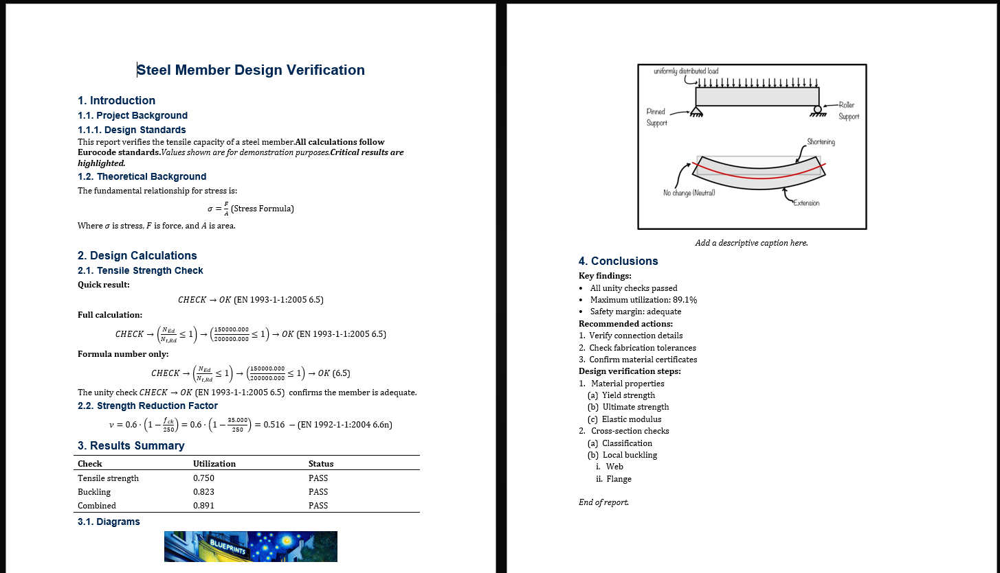
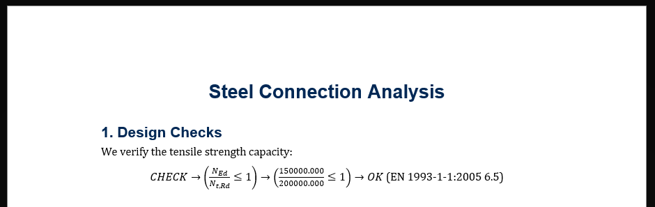
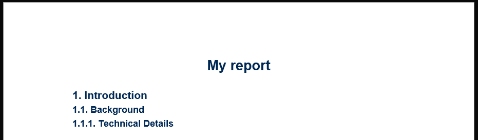
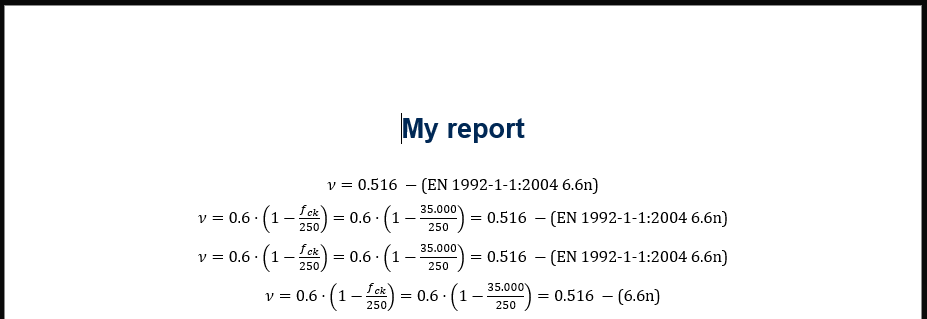
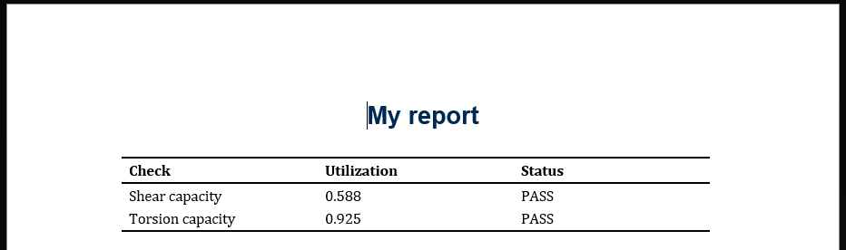
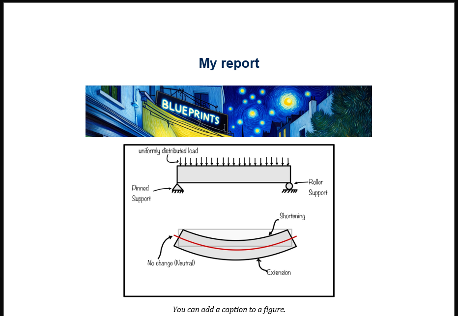
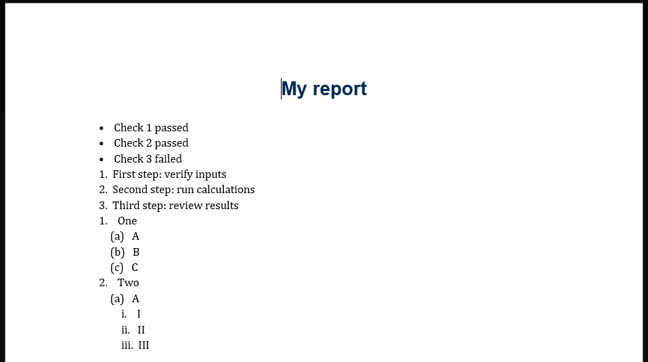

# Creating Reports with Blueprints

The `Report` class helps you build professional engineering reports with text, equations, tables, and figures. 


??? info "Complete Example"

    Use the following code to create an engineering report showcasing all available elements:

    

    ```python exec="on" source="tabbed-left" result="console"
    from blueprints.utils.report import Report
    from blueprints.codes.eurocode.en_1993_1_1_2005.chapter_6_ultimate_limit_state import formula_6_5
    from blueprints.codes.eurocode.en_1992_1_1_2004.chapter_6_ultimate_limit_state import formula_6_6n

    # Create report with title
    report = Report(title="Steel Member Design Verification")

    # --- HEADINGS (3 levels) ---
    report.add_heading("Introduction")
    report.add_heading("Project Background", level=2)
    report.add_heading("Design Standards", level=3)

    # --- PARAGRAPHS (text formatting) ---
    report.add_paragraph("This report verifies the tensile capacity of a steel member.")
    report.add_paragraph("All calculations follow Eurocode standards.", bold=True)
    report.add_paragraph("Values shown are for demonstration purposes.", italic=True)
    report.add_paragraph("Critical results are highlighted.", bold=True, italic=True)
    report.add_newline()

    # --- EQUATIONS (standalone and inline) ---
    report.add_heading("Theoretical Background", level=2)
    report.add_paragraph("The fundamental relationship for stress is:")
    report.add_equation(equation=r"\sigma = \frac{F}{A}", tag="Stress Formula")

    report.add_paragraph("Where ").add_equation(r"\sigma", inline=True).add_paragraph(" is stress, ")
    report.add_equation(r"F", inline=True).add_paragraph(" is force, and ")
    report.add_equation(r"A", inline=True).add_paragraph(" is area.")
    report.add_newline(n=2)

    # --- BLUEPRINTS FORMULAS (all options) ---
    report.add_heading("Design Calculations")
    report.add_heading("Tensile Strength Check", level=2)

    unity_check = formula_6_5.Form6Dot5UnityCheckTensileStrength(n_ed=150000, n_t_rd=200000)

    # Short form (result only)
    report.add_paragraph("Quick result:", bold=True)
    report.add_formula(unity_check, options="short")

    # Complete form (full derivation)
    report.add_paragraph("Full calculation:", bold=True)
    report.add_formula(unity_check, options="complete")

    # Without source document in tag
    report.add_paragraph("Formula number only:", bold=True)
    report.add_formula(unity_check, options="complete", include_source=False)

    # Inline formula
    report.add_paragraph("The unity check ").add_formula(unity_check, options="short", inline=True)
    report.add_paragraph(" confirms the member is adequate.")
    report.add_newline()

    # Another formula with units
    report.add_heading("Strength Reduction Factor", level=2)
    strength_factor = formula_6_6n.Form6Dot6nStrengthReductionFactor(f_ck=35)
    report.add_formula(strength_factor, options="complete_with_units")

    # --- TABLES ---
    report.add_heading("Results Summary")
    report.add_table(
        headers=[r"\text{Check}", r"\text{Utilization}", r"\text{Status}"],
        rows=[
            [r"\text{Tensile strength}", "0.750", r"\text{PASS}"],
            [r"\text{Buckling}", "0.823", r"\text{PASS}"],
            [r"\text{Combined}", "0.891", r"\text{PASS}"],
        ]
    )

    # --- FIGURES ---
    report.add_heading("Diagrams", level=2)
    report.add_figure("cross_section.png", width=0.5)
    report.add_figure("stress_diagram.png", width=0.7, caption="Stress distribution along member length")

    # --- LISTS (bulleted, numbered, nested) ---
    report.add_heading("Conclusions")

    # Bulleted list
    report.add_paragraph("Key findings:", bold=True)
    report.add_list([
        "All unity checks passed",
        "Maximum utilization: 89.1%",
        "Safety margin: adequate",
    ], style="bulleted")

    # Numbered list
    report.add_paragraph("Recommended actions:", bold=True)
    report.add_list([
        "Verify connection details",
        "Check fabrication tolerances",
        "Confirm material certificates",
    ], style="numbered")

    # Nested list
    report.add_paragraph("Design verification steps:", bold=True)
    report.add_list([
        "Material properties",
        ["Yield strength", "Ultimate strength", "Elastic modulus"],
        "Cross-section checks",
        ["Classification", "Local buckling", ["Web", "Flange"]]
    ], style="numbered")

    # --- SPACING ---
    report.add_newline(n=2)
    report.add_paragraph("End of report.", italic=True)

    # Get LaTeX document
    latex = report.to_latex()
    print(latex)
    ```

??? info "Tips"

    - Use **method chaining** for cleaner code: `report.add_heading(...).add_paragraph(...).add_newline()`
    - Use raw strings (`r"..."`) for LaTeX commands to avoid escape issues
    - Call `.to_latex()` for a final Latex-formatted output
    - Call `.to_word()` to export directly to a Word document
    - Call `.add_formula()` on formulas from Blueprints to automatically include source and formula numbers in the tag

## Quick Start

Create a report and add content using [method chaining](https://www.geeksforgeeks.org/python/method-chaining-in-python/):



```python exec="on" session="report_quick_start" source="tabbed-left" result="console"
from blueprints.utils.report import Report
from blueprints.codes.eurocode.en_1993_1_1_2005.chapter_6_ultimate_limit_state import formula_6_5

# Create a report
report = Report(title="Steel Connection Analysis")

# Add sections and content
report.add_heading("Design Checks")
report.add_paragraph("We verify the tensile strength capacity:")

# Add a formula
formula = formula_6_5.Form6Dot5UnityCheckTensileStrength(
    n_ed=150000,  # Applied force (N)
    n_t_rd=200000,  # Resistance (N)
)
report.add_formula(formula, options="complete")

# Generate the complete LaTeX document
latex_code = report.to_latex()
print(latex_code)
```

## Getting Your Report

### Export to LaTeX

A very useful way to work with the report is to export it as a LaTeX document. You can then compile it with your favorite LaTeX editor (Overleaf, TeXShop, etc.) or command-line tool (pdflatex, xelatex, etc.).

```python exec="on" session="report_quick_start" source="above"
# Save the complete LaTeX document to your local disk (ready for Overleaf or pdflatex)
report.to_latex('report.tex')
```

### Export to Word

You can convert your report to a Word document directly in three ways:


**Save to a file path:**

```python exec="on" source="tabbed-left" result="console"
from blueprints.utils.report import Report

# Create a report
report = Report(title="My report")
report.add_heading("Introduction")
report.add_paragraph("Some content here.")

# Save to file
report.to_word("report.docx")
```

**Write to bytes (for in-memory processing):**

```python exec="on" source="tabbed-left" result="console"
from blueprints.utils.report import Report
from io import BytesIO

# Create a report
report = Report(title="My report")
report.add_heading("Introduction")
report.add_paragraph("Some content here.")

# Write to bytes (useful for web downloads, email attachments, etc.)
docx_bytes = report.to_word()

print(f"Document size: {len(docx_bytes)} bytes")
```

**Get bytes directly (useful for streaming or email):**

```python exec="on" source="tabbed-left" result="console"
from blueprints.utils.report import Report

# Create a report
report = Report(title="My report")
report.add_heading("Introduction")
report.add_paragraph("Some content here.")

# Get bytes directly
docx_bytes = report.to_word()
print(f"Document size: {len(docx_bytes)} bytes")

# Now you can stream it, send as email attachment, store in database, etc.
```

### Export to PDF

Compile your report directly to PDF using `to_pdf()`. This requires a LaTeX distribution with `pdflatex` installed on your system.

!!! info "Prerequisite: LaTeX Installation"

    You need a LaTeX distribution that includes `pdflatex`. Download from:

    - [MiKTeX](https://miktex.org/download) (Windows, macOS, Linux)
    - [TeX Live](https://www.tug.org/texlive/) (Windows, macOS, Linux)

    In the case you can't install one of those locally, consider using an online LaTeX service like [Overleaf](https://www.overleaf.com/) to compile the LaTeX document generated by `to_latex()` or use the `.to_word()` export option and convert to PDF via Word.

**Save to a file path:**

```python
from blueprints.utils.report import Report

# Create a report
report = Report(title="My report")
report.add_heading("Introduction")
report.add_paragraph("Some content here.")

# Save to PDF file
report.to_pdf("report.pdf")
```

**Get PDF as bytes (for in-memory processing):**

```python
from blueprints.utils.report import Report

# Create a report
report = Report(title="My report")
report.add_heading("Introduction")
report.add_paragraph("Some content here.")

# Get PDF bytes directly
pdf_bytes = report.to_pdf()
print(f"PDF size: {len(pdf_bytes)} bytes")

# Now you can stream it, send as email attachment, store in database, etc.
```

**Keep auxiliary files for debugging:**

```python
from blueprints.utils.report import Report

# Create a report
report = Report(title="My report")
report.add_heading("Introduction")
report.add_paragraph("Some content here.")

# Keep .aux, .log, .out files alongside the PDF for debugging LaTeX issues
report.to_pdf("report.pdf", cleanup=False)
```

## Translate Your Report

Export your report in different languages using the `language` parameter. This works with `to_latex()`, `to_word()`, and `to_pdf()`. Note: this feature is slow in a .ipynb notebook environment.

!!! warning "Translation Support"

    We use currently online (and free) translation services for this feature. We assume no liability for translation accuracy.
    
    Currently only English (`"en"`) is officially supported as the default. Other languages use automatic translation and may require manual review for technical accuracy.

**Export to Dutch:**

```python exec="on" source="tabbed-left" result="console"
from blueprints.utils.report import Report

report = Report(title="Design Report")
report.add_heading("Introduction")
report.add_paragraph("This steel beam has been verified for bending.")

# Export in German
latex_dutch = report.to_latex(language="nl")
print(latex_dutch)
```

**Export to multiple languages:**

```python exec="on" source="tabbed-left" result="console"
from blueprints.utils.report import Report

report = Report(title="Analysis Results")
report.add_heading("Summary")
report.add_paragraph("All checks passed successfully.")

# Save in different languages
report.to_latex("report_en.tex", language="en")  # English (default)
report.to_latex("report_nl.tex", language="nl")  # Dutch
report.to_latex("report_es.tex", language="es")  # Spanish
report.to_latex("report_de.tex", language="de")  # German
report.to_latex("report_fr.tex", language="fr")  # French

# Also works with Word and PDF
report.to_word("report_nl.docx", language="nl")
```

**Supported languages:**

Use any language code from [Google Cloud Translate](https://cloud.google.com/translate/docs/languages). Common codes:

| Code | Language |
|------|----------|
| `en` | English (default) |
| `nl` | Dutch |
| `es` | Spanish |
| `de` | German |
| `fr` | French |
| `it` | Italian |
| `pt` | Portuguese |
| `pl` | Polish |

## Combine Reports

Combine multiple reports into one using the `+` operator. This is useful for building modular reports where each chapter or section is created separately.

**Basic combination:**

```python exec="on" source="tabbed-left" result="console"
from blueprints.utils.report import Report

# Create separate report sections
intro = Report(title="Design Report")
intro.add_heading("Introduction")
intro.add_paragraph("This report covers the structural design.")

calcs = Report()
calcs.add_heading("Calculations")
calcs.add_equation("M = F \\cdot d", tag="1")

conclusion = Report()
conclusion.add_heading("Conclusion")
conclusion.add_paragraph("All checks passed.")

# Combine into final report (title comes from the first report)
final_report = intro + calcs + conclusion
print(final_report)
```

**Modular report structure:**

```python exec="on" source="tabbed-left" result="console"
from blueprints.utils.report import Report

# Build chapters independently
chapter_1 = Report(title="Steel Connection Design")
chapter_1.add_heading("Chapter 1: Material Properties")
chapter_1.add_paragraph("Steel grade S355 is used throughout.")

chapter_2 = Report()
chapter_2.add_heading("Chapter 2: Load Cases")
chapter_2.add_paragraph("Three load combinations are considered.")

chapter_3 = Report()
chapter_3.add_heading("Chapter 3: Design Checks")
chapter_3.add_paragraph("Unity checks for all connections.")

annex_a = Report()
annex_a.add_heading("Annex A: Detailed Calculations")
annex_a.add_paragraph("Step-by-step calculation sheets.")

annex_b = Report()
annex_b.add_heading("Annex B: Drawings")
annex_b.add_paragraph("Some drawings.")

# Assemble the complete report
complete_report = chapter_1 + chapter_2 + chapter_3 + annex_a + annex_b

# Export the combined report
complete_report.to_latex("full_design_report.tex")
print(complete_report)
```

!!! tip "Title Handling"
    The combined report inherits the title from the **first** (leftmost) report. Reports without titles can be used for chapters and annexes.

## Common Tasks

### Add Text


```python exec="on" source="tabbed-left" result="console"
from blueprints.utils.report import Report

# Create a report
report = Report(title="My report")

report.add_paragraph("This is regular text.").add_newline()
report.add_paragraph("This is bold text.", bold=True).add_newline(n=2)
report.add_paragraph("This is italic text....", italic=True)
report.add_paragraph("This is bold and italic.", bold=True, italic=True)

print(report.to_latex())
```

### Add Sections



```python exec="on" source="tabbed-left" result="console"
from blueprints.utils.report import Report

# Create a report
report = Report(title="My report")

report.add_heading("Introduction")
report.add_heading("Background", level=2)
report.add_heading("Technical Details", level=3)

print(report.to_latex())
```

### Add Equations

**Standalone equation:**


```python exec="on" source="tabbed-left" result="console"
from blueprints.utils.report import Report

# Create a report
report = Report(title="My report")

report.add_equation(equation="a^2 + b^2 = c^2", tag="Pythagoras")

print(report.to_latex())
```

**Inline equation (within text):**


```python exec="on" source="tabbed-left" result="console"
from blueprints.utils.report import Report

# Create a report
report = Report(title="My report")

report.add_paragraph("The resistance is ").add_equation(r"\frac{F_y \cdot A}{1.0}", inline=True).add_paragraph(" kN")

print(report.to_latex())
```

### Add Blueprints Formulas

Integrate Blueprints formulas with different levels of detail:



```python exec="on" source="tabbed-left" result="console"
from blueprints.codes.eurocode.en_1992_1_1_2004.chapter_6_ultimate_limit_state import formula_6_6n
from blueprints.utils.report import Report

# Create a report
report = Report(title="My report")

formula = formula_6_6n.Form6Dot6nStrengthReductionFactor(35)

# Add with different detail levels
report.add_formula(formula, options="short")  # Just result
report.add_formula(formula, options="complete")  # Full derivation
report.add_formula(formula, options="complete_with_units")  # With unit labels

# Control what's shown in the tag
report.add_formula(
    formula,
    options="complete",
    include_source=False,  # Hide "EN 1992-1-1:2004"
    include_formula_number=True,  # Show "6.6n"
)
print(report.to_latex())
```

### Add Tables



```python exec="on" source="tabbed-left" result="console"
from blueprints.utils.report import Report

# Create a report
report = Report(title="My report")

report.add_table(
    headers=["Check", "Utilization", "Status"],
    rows=[
        [r"\text{Shear capacity}", "0.588", r"\text{PASS}"],
        [r"\text{Torsion capacity}", "0.925", r"\text{PASS}"],
    ]
)
print(report.to_latex())
```

### Add Figures



```python exec="on" source="tabbed-left" result="console"
from blueprints.utils.report import Report

# Create a report
report = Report(title="My report")

# Simple figure
report.add_figure("blueprints.png")

# Figure with caption
report.add_figure(image_path="beam.png", width=0.7, caption="You can add a caption to a figure.")

print(report.to_latex())
```

### Add Lists


```python exec="on" source="tabbed-left" result="console"
from blueprints.utils.report import Report

# Create a report
report = Report(title="My report")

# Bullet list
report.add_list(["Check 1 passed", "Check 2 passed", "Check 3 failed"], style="bulleted")

# Numbered list
report.add_list(["First step: verify inputs", "Second step: run calculations", "Third step: review results"], style='numbered')

# Numbered list, nested
report.add_list(["One", ["A", "B", "C"], "Two", ["A", ["I", "II", "III"]]], style="numbered")

print(report.to_latex())
```

### Add Spacing

```python exec="on" source="tabbed-left" result="console"
from blueprints.utils.report import Report

# Create a report
report = Report(title="My report")

report.add_newline()  # Single new line
report.add_newline(n=3)  # Three new lines

print(report.to_latex())
```