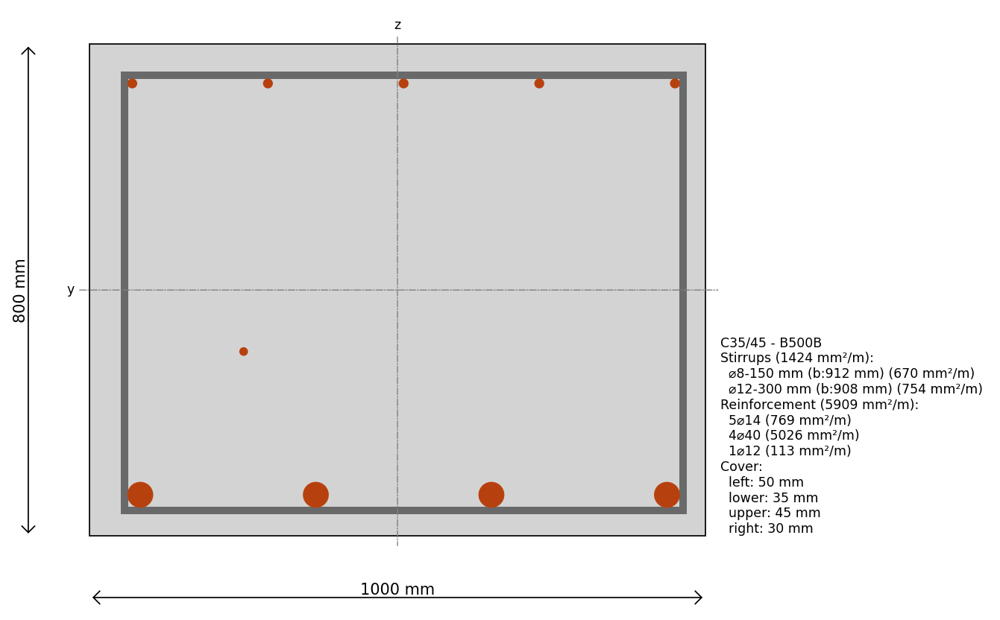

Examples
========

Here are some examples of how to use the 'Blueprints'.

Make a Rectangular Reinforced Cross-section
-------------------------------------------

.. code-block:: python
    from blueprints.materials.concrete import ConcreteMaterial, ConcreteStrengthClass
    from blueprints.materials.reinforcement_steel import ReinforcementSteelQuality, ReinforcementSteelMaterial
    from blueprints.structural_sections.concrete.rebar import Rebar
    from blueprints.structural_sections.concrete.reinforced_concrete_sections.rectangular import RectangularReinforcedCrossSection

    # Define a concrete material
    concrete = ConcreteMaterial(concrete_class=ConcreteStrengthClass.C35_45)

    # Define a reinforcement steel material
    steel = ReinforcementSteelMaterial(steel_quality=ReinforcementSteelQuality.B500B)

    # Define a rectangular reinforced cross-section
    cs = RectangularReinforcedCrossSection(
        width=1000,
        height=800,
        covers=(45, 30, 35, 50),  # upper, right, lower, left
        concrete_material=concrete,
    )

    # Add reinforcement to the cross-section
    cs.add_longitudinal_reinforcement_by_quantity(
        n=5,
        diameter=14,
        edge="upper",
        material=steel,
    )
    cs.add_longitudinal_reinforcement_by_quantity(
        n=4,
        diameter=40,
        edge="lower",
        material=steel,
    )

    # Add stirrups to the cross-section
    cs.add_stirrup_along_edges(
        diameter=8,
        distance=150,
        material=steel,
    )
    # Add stirrups to the cross-section
    cs.add_stirrup_along_edges(
        diameter=12,
        distance=300,
        material=steel,
    )

    # Add a longitudinal rebar to the cross-section
    cs.add_longitudinal_rebar(
        rebar=Rebar(
            diameter=12,
            x=-250,
            y=-100,
            material=steel,
        )
    )

    cs.plot(show=True)

