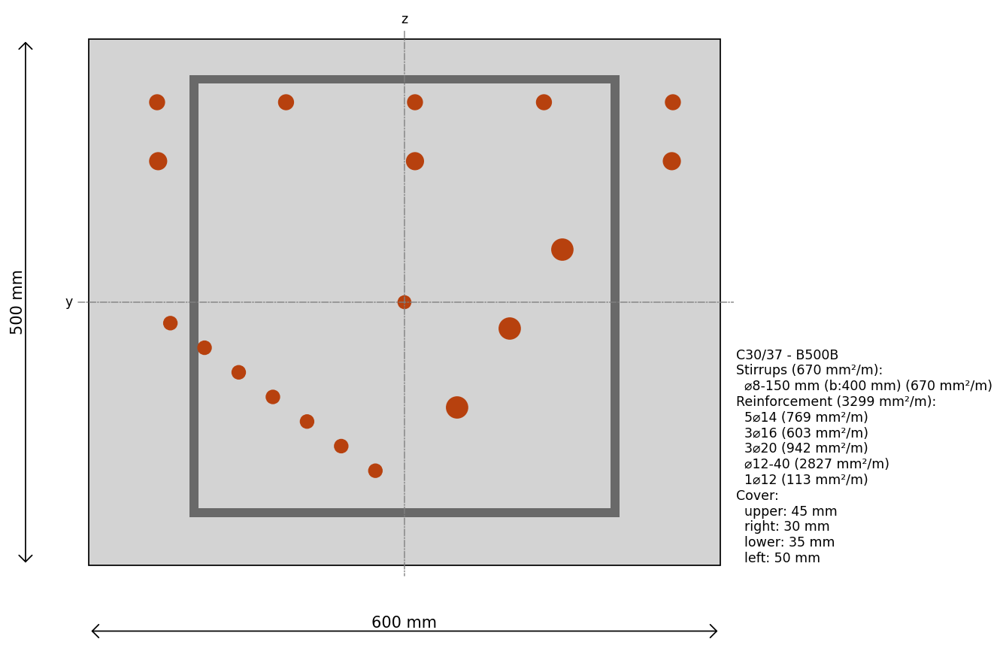

Rectangular Reinforced Cross-section
-------------------------------------------
Simply create a rectangular cross-section and add some reinforcement:

.. literalinclude:: examples/rectangular_reinforced_cross_section.py

.. image:: data/images/rectangular_reinforced_cross_section.png
    :alt: Rectangular Reinforced Cross-section
    :align: center

And just to show that you can create any RCS you like, here is a custom one:

.. literalinclude:: examples/rectangular_reinforced_cross_section_custom.py

